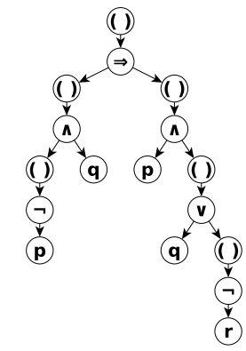
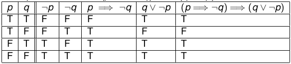
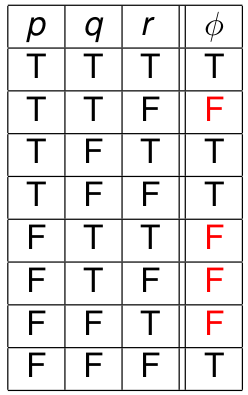
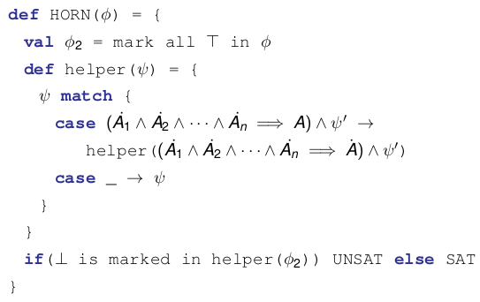
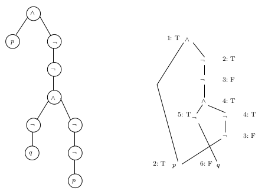

# 1.1 Declarative Sentences

Propositions (Declarative Sentences): a statement that can be declared true or false.

Use Symbols for **atomic** propositions: 

- Ex. 
    - p = "the train arrived late"
    - q = "there were no taxis at the station"
    - r = "Jane was late for her meeting"

## Building Propositions

More complex sentences can be created using connectives:

- Negation ($\neg$p): "not p"
- Disjunction (p $\vee$ q): "p or q"
- Conjunction (p $\wedge$ q): "p and q"
- Implication (p $\rightarrow$ q): "if p then q"

Conventions:

- Operator precedence, $\neg$ (highest), $\wedge$, $\vee$, $\rightarrow$
- Associativity $\rightarrow$ (right), $\wedge\text{/}\vee$ (doesn't matter) 
    - This means everything right of $\rightarrow$ is grouped together

# 1.2 Natural Deduction

## Deducing Propositions

Sequent: $\phi$~1~, $\phi$~2~, ... , $\phi$,~n~ $\vdash$ $\psi$

- Premises:  $\phi$~1~, $\phi$~2~, ... , $\phi$,~n~
- Conclusion: $\psi$

A sequent is valid if a proof can be found to make the premises into the conclusion. 

\*Sequent != Implication

## Rules for Conjunction (AND)

AND-INTRO: $\displaystyle \frac{\phi \;\;\; \psi}{\phi \wedge \psi}$

AND-ELIM1: $\displaystyle \frac{\phi \wedge \psi}{\phi}$

AND-ELIM2: $\displaystyle \frac{\phi \wedge \psi}{\psi}$

## Rules for Double Negation (NOT NOT)

NOT-NOT-INTRO: $\displaystyle \frac{\phi}{\neg\neg\phi}$

NOT-NOT-ELIM: $\displaystyle \frac{\neg\neg\phi}{\phi}$

## Rules for Implication (&rarr;)

IMP-INTRO: $\displaystyle \frac{\phi \text{...|} \psi}{\phi \rightarrow \psi}$

IMP-ELIM: $\displaystyle \frac{\phi \;\;\; \phi \rightarrow \psi}{\psi}$

- This is also known is Modus Ponens

## Rules for Disjunction (OR)

OR-INTRO1: $\displaystyle \frac{\phi}{\phi \vee \psi}$

OR-INTRO2: $\displaystyle \frac{\psi}{\phi \vee \psi}$

OR-ELIM: $\displaystyle \frac{\phi \vee \psi \;\;\; \phi \text{...|}\chi \;\;\; \psi \text{...|} \chi}{\chi}$

## Rules for Negation (NOT)

NOT-INTRO: $\displaystyle \frac{\phi \text{...|} \bot}{\neg \phi}$

NOT-ELIM: $\displaystyle \frac{\phi \;\;\; \neg \phi}{\bot}$

## Rules for False

FALSE-ELIM: $\displaystyle \frac{\bot}{\phi}$

## Other Helpful Rules

MODUS-TOLLENS: $\displaystyle \frac{\phi \rightarrow \psi \;\;\; \neg\psi}{\neg \phi}$

PROOF-BY-CONTRADICTION: $\displaystyle \frac{\neg \phi \text{...|} \bot}{\phi}$

LAW-EXCL-MID: $\displaystyle \frac{}{\phi \vee \neg \phi}$

## Provable Equivalence

If $\phi$ $\vdash$ $\psi$ and $\psi$ $\vdash$ $\phi$, we say $\phi$ and $\psi$ are **provably equivalent**

Notation: $\phi \; \dashv \vdash \; \psi$

# Theorem

If $\vdash$ $\phi$, we say that $\phi$ is a *thoerem*

- Theorems are conclusions that do not require any premises
- Ex. $\vdash$ $\phi$ &rarr; $\phi$
    - To prove this sequent valid, simply assume $\phi$ and then use ImpIntro. 

# 1.3 Propositional Logic as a Formal Language

Want to use propositional logic as a **specification language**

We need to formalize:

- What this language looks like (syntax)
- What sentences in the language mean (semantics)

## Well-formed Formulas

Proof rules apply for "any" formulas $\phi$, $\psi$

[comment]: # (Example slide 2.9)

- Ex. Show: p $\vee$ $\neg$r, (p $\vee$ $\neg$r) &rarr; (r &rarr; p) $\vdash$ r &rarr; p

>> $\phi$ = p $\vee$ $\neg$r 

>> $\psi$ = r &rarr; p

>> Proof rules apply to any formula, $\phi$ and $\psi$ can be as complicated as they want, as long as it still fit the pattern. 

Caveat: not just any formula - only well-formed

- Ex. a, a &rarr; $\wedge$ $\vdash$ $\wedge$
    - This formula makes no sense 

Alphabet of propositional logic ($\sum$): {$\neg$, $\vee$, $\wedge$, &rarr;, (,)} $\cup$ {a,b,c,...}

- Infinitely-many atomic propositions a,b,c, ...

### Well-Formed Formulas - Inductive Definition

Inductively defining the set W of well-formed formulas for propositional logic. 

Well-formed formulas of propositional logic are obtained form using **only** these construction rules: 

- Every propositional atom a,b,c is a well-formed formula. 
- $\neg$: If $\phi$ is a well-formed formula, then so is ($\neg\phi$)
- $\wedge$: If $\phi$ and $\psi$ are well-formed formulas, then so is ($\phi$ $\wedge$ $\psi$)
- $\vee$: If $\phi$ and $\psi$ are well-formed formulas, then so is ($\phi$ $\vee$ $\psi$)
- &rarr;: If $\phi$ and $\psi$ are well-formed formulas, then so is ($\phi$ &rarr; $\psi$)

## Syntax of Propositional Logic

Alternative: describe well-formed formulas using grammar. 

Grammar for propositions (Backus Naur Form):

$\phi$ ::= p | ($\phi$) | $\phi$ $\wedge$ $\phi$ | $\phi$ $\vee$ $\phi$ | $\phi$ &rarr; $\phi$

- This is the well-formed construction rules condensed. 

\newpage

Example: Is ((($\neg$p) $\wedge$ q) &rarr; (p $\wedge$ (q $\vee$ ($\neg$r)))) well-formed?

{width=40%}

- Parse tree also encodes **subformulas** (Any sub-tree corresponds to a subformula)
    - Ex. Right-most subtree with () as root is a subformula 
- For a parser, the starting node is $\phi$ from the Back Naur form equation. 

## Non-well-formed Formulas

How can we show that a $\vee$ b$\neg$ is not well-formed?

- Based on grammar, $\neg$ must be followed by a proposition
- In general, need to search through potential parse trees
    - Parse does this for us automatically

# 1.4 Semantics of Propositional Logic

## Truth Tables

Truth tables: define meaning of formulas based on whether their subformulas are true/false.

{width=60%}

## Strong Induction 

Assume: P(0), P(1), ..., P(K) are true 

Use assumption to prove P(K + 1)

### Strong Induction Example

Problem: prove that for any propositional logic well-formed formula, the number of left parentheses equals the number of right. 

Basic Idea: Use induction over the height of formula's parse tree T

1. Base Case (height = 1) holds: the parse tree T can only be a single node (atomic proposition), so there are no parentheses. 

2. Inductive Step (height > 1): assume that the property holds for all parse trees of height n-1. Consider a parse tree T of height n. There are 3 cases: 

- If the root node is one of &rarr;, $\wedge$, $\vee$ then the left/right subtrees both have height n-1. By the induction hypothesis, both subtrees have matching numbers of left/right parentheses. Therefore, so does T. 
- If the root node is $\neg$, then the subtree has height n-1. By the induction hypothesis, this subtree has matching numbers of left/right parentheses. Therefore, so does T. 
- If the root node is (), then the subtree has height n-1. By the induction hypothesis, this subtree has matching numbers of left/right parentheses, so adding 1 left and 1 right maintains this property for T. 

## Entailment

Entailment: semantic concept. 

> $\phi$~1~, $\phi$~1~, ... , $\phi$~n~ $\models$ $\psi$

This is different from the syntactic concept of sequent

> $\phi$~1~, $\phi$~1~, ... , $\phi$~n~ $\vdash$ $\psi$

Entailment says: for all valuations which makes $\phi$~1~, $\phi$~1~, ... , $\phi$~n~ true, $\psi$ is also true. 

## Soundness of Propositional Logic

Natural deduction doesn't let us reach incorrect conclusions

- If $\phi$~1~, $\phi$~1~, ... , $\phi$~n~ $\vdash$ $\psi$ is valid, then $\phi$~1~, $\phi$~1~, ... , $\phi$~n~ $\models$ $\psi$ holds
- Soundness in formal methods typically has this form: if we can derive $\psi$ using syntactic rules, then $\psi$ is semantically correct. 

## Completeness of Propositional Logic

Correct facts can always be deduced via natural deduction

If $\phi$~1~, $\phi$~1~, ... , $\phi$~n~ $\models$ $\psi$ holds, then $\phi$~1~, $\phi$~1~, ... , $\phi$~n~ $\vdash$ $\psi$ is valid

Completeness in formal methods typically has this form: if $\psi$ is semantically correct, then we can prove that $\psi$'s correctness using syntactic rules. 

## Syntactic VS Semantic Reasoning

$\phi$~1~, $\phi$~1~, ... , $\phi$~n~ $\vdash$ $\psi$ is valid **if and only if** $\phi$~1~, $\phi$~1~, ... , $\phi$~n~ $\models$ $\psi$ holds

For propositional logic, we can do either syntactic or semantic reasoning!

$\vdash$ requires proof search, and $\models$ requires examining a truth table of exponential size. 

Interesting consequences: 

> $\vdash$ $\psi$ **if and only if** $\models$ $\psi$

$\psi$ is a theorem if and only if $\psi$ is a tautology. 

A proposition is a theorem if and only if a proposition is a tautology. 

# 1.5 Normal Forms

## Semantic Equivalence and Validity 

Syntactic equivalence: $\phi$ $\dashv$$\vdash$ $\psi$

Semantic equivalence: 

- Say $\phi$, $\psi$ are semantically equivalent if $\phi$ $\models$ $\psi$ and $\psi$ $\models$ $\phi$
- Denoted: $\phi$ $\equiv$ $\psi$
- Means equal truth tables

### Entailment VS Implication

[comment]: # (Go over textbook explanation)

$\phi$~1~, $\phi$~2~, ..., $\phi$~n~ $\models$ $\psi$ holds

> if and only if

$\models$ $\phi$~1~ $\implies$ ($\phi$~2~ $\implies$ ( ... $\implies$ ($\phi$~n~ $\implies$ $\psi$))) holds

> above equation is equivalent to

($\phi$~1~ $\wedge$ $\phi$~2~ $\wedge$ ... $\wedge$ $\phi$~n~) $\implies$ $\psi$

### Satisfiability 

A formula $\phi$ is **satisfiabile** if there is a valuation that makes $\phi$ evaluate to T (If there is a T row in $\phi$'s truth table).

- Ex. a $\wedge$ $\neg$a is unsatisfiable 

Useful theorem: $\phi$ is satisfiable if and only if $\neg\phi$is not a tautology. 

## Conjunctive Normal Form (CNF) 

Propositions is in CNF if it's a conjunction of disjunctions. 

Syntax of CNF formulas:

> C::= D | D $\wedge$ C (conjunction)

> D::= L | L $\vee$ D (disjunction)

> L::= p | $\neg$p (literal)

Important theorem: Disjunction L~1~ $\vee$ L~2~ $\vee$ ... $\vee$ L~n~ is a tautology if and only if there are i, j such that L~i~ is $\neg$L~j~

### Building CNF from Truth Table:

Steps: 

- Build disjunction $\psi$~k~ for each FALSE (F) row k 
- Negate truth atoms, leave false atoms

Example: 

> \
{width=20%}

- $\psi$~2~ = $\neg$p $\vee$ $\neg$q $\vee$ r
- $\psi$~5~ = p $\vee$ $\neg$q $\vee$ $\neg$r
- $\psi$~6~ = p $\vee$ $\neg$q $\vee$ r
- $\psi$~7~ = p $\vee$ q $\vee$ $\neg$r
- CNF result: $\phi$~2~ $\wedge$ $\phi$~5~ $\wedge$ $\phi$~6~ $\wedge$ $\phi$~7~    

### CNF Algorithm

CNF(NNF(IMPL-FREE($\phi$)))

1. IMPL-FREE: Remove implications
    - Ex. Convert $\phi$ $\implies$ $\psi$ to $\
2. NNF: Convert to negation-normal form 
    - Ex. a $\wedge$ $\neg$(a $\wedge$ b) (NOT NEGATION NORMAL)
    - a $\wedge$ ($\neg$a $\wedge$ $\neg$b) (YES NEGATION NORMAL)
3. CNF: Convert to CNF

### Algorithm: IMPL-FREE

Overall task: get rid of implications

> Convert $\phi$ $\implies$ $\psi$ to $\neg\phi$ $\vee$ $\psi$

\newpage

### Algorithm: NNF

Overall task: move negation "inward" as much as possible

> def NNF($\phi$) = {

>> $\phi$ match { 

>>> case (p | $\neg$p) &rarr; $\phi$

>>> case $\neg\neg$ &rarr; NNF($\psi$)

>>> case $\psi$~1~ $\wedge$ $\psi$~2~ &rarr; NNF($\psi$~1~) $\wedge$ NNF($\psi$~2~) 

>>> case $\psi$~1~ $\vee$ $\psi$~2~ &rarr; NNF($\psi$~1~) $\vee$ NNF($\psi$~2~) 

>>> case $\neg$($\psi$~1~ $\vee$ $\psi$~2~) &rarr; NNF($\neg\psi$~1~) $\vee$ NNF($\neg\psi$~2~) 

>>> case $\neg$($\psi$~1~ $\wedge$ $\psi$~2~) &rarr; NNF($\neg\psi$~1~) $\wedge$ NNF($\neg\psi$~2~)

>> }

> }

### Algorithm: CNF

Overall task: handle all but negation

> def CNF($\phi$) = {

>> $\phi$ match {

>>> case (p | $\neg$p) &rarr; $\phi$

>>> case $\psi$ $\wedge$ $\psi$ &rarr; CNF($\psi$~1~) $\wedge$ CNF($\psi$~2~) 

>>> case $\psi$ $\vee$ $\psi$ &rarr; DISTR(CNF($\psi$~1~), CNF($\psi$~2~))

>> }

> }

### Algorithm: DISTR

Overall task: use distributive property (a $\wedge$ b) $\vee$ c $\equiv$ (a $\vee$ c) $\wedge$ (b $\vee$ c)

> def DISTR($\phi$~1~, $\phi$~2~) = {

>> ($\phi$~1~, $\phi$~2~) match {

>>> case ($\psi$~1~ $\wedge$ $\psi$~2~, _) &rarr; 

>>>> DISTR($\psi$~1~, $\phi$~2~) $\wedge$ DISTR($\psi$~2~, $\phi$~1~)

>>> case (_, $\psi$~1~ $\wedge$ $\psi$~2~) &rarr; 

>>>> DISTR($\phi$~1~, $\psi$~1~) $\wedge$ DISTR($\phi$~1~, $\psi$~2~)

>>> case _ &rarr; $\phi$~1~ $\vee$ $\phi$~2~

>> }

> }
 
## Horn Clauses

F = Horn formula

C = Single horn clause

B = Collection of conjunctions

A = Single atom 

&nbsp; 

F ::= C | C $\wedge$ F (Horny Formula) 

C ::= B $\implies$ A (Clause) 

B ::= A | A $\wedge$ A (Body)

A ::= p | $\bot$ | $\top$

\* Atomic propositions cannot be negated

### Horn Satisfiability

Overall goal: check for chain of implications $\top$ $\implies$ ... $\implies$ $\bot$

[comment]: # (add horn satisfiability) 

\
{width=70%}

\newpage

# 1.6 SAT Solvers

## 3-SAT

Format: CNF formula = (a $\vee$ b $\vee$ c) $\wedge$ (b $\vee$ d $\vee$ f) $\wedge$ (b $\vee$ d $\vee$ f)  

2 Possible Answers: SAT or UNSAT

### Rewriting Propositions

Rewrite everything with just $\wedge$ and $\neg$

- T(p) = p
- T($\neg\phi$) = $\neg$T($\phi$)
- T($\phi$~1~ $\wedge$ $\phi$~2~) = T($\phi$~1~) $\wedge$ T($\phi$~2~)
- T($\phi$~1~ $\implies$ $\phi$~2~) = $\neg$(T($\phi$~1~) $\wedge$ $\neg$T($\phi$~2~))
- T($\phi$~1~ $\vee$ $\phi$~2~) = $\neg$($\neg$T($\phi$~1~) $\wedge$ $\neg$T($\phi$~2~))
 
### Example

Consider $\phi$ = p $\wedge$ $\neg$(q $\vee$ $\neg$p). What is T($\phi$)?

> T($\phi$) = p $\wedge$ $\neg\neg$($\neg$q $\wedge$ $\neg\neg$p)

\

- Combine proposition in tree (leaves) 
- Start with True at top and go down 

### Sat Forcing Algorithms

\

### Incompleteness 

$\neg$($\phi$~1~ $\wedge$ $\phi$~2~)

No rule for labeling both children of an F node

This algorithm will terminate with "unknown" on some inputs (incomplete) 

Need a way to handle incompleteness

# DPLL

Algorithm to determine satisfiability of a set of clauses

General concept:

- Start from a ground CNF formula (a $\vee$ b $\vee$ c) $\wedge$ (b $\vee$ d $\vee$ f) $\wedge$ (b $\vee$ d $\vee$ f)
- Try to build an assignment that verifies the formula
- The assignment is built using a backtracking mechanism 
- Worst Case: iterate through entire truth table

Simple Sketch: A tree of possible assignments is used to guide the procedure

- Each node is a set of clauses S~i~
- At each node one of the Literal is assigned a truth value
- Truth values are propagated to reduce the number of future assignments

## DPLL Algorithm

Clause = (x $\vee$ x $\vee$ x) 

Algorithm: 

- Input = S = C~0~ = Set of clauses {C~1~, ..., C~k~} 
- Set C~0~ as the root of the tree
- Apply (inference) rules to leaves, expanding the tree
- A branch of the tree is no longer expanded if S~i~ = {} or {{}} $\in$ S~i~ where {{}} is the empty clause.
- If S~i~ = {} then S is satisfiable and we can stop the procedure
- If {{}} $\in$ S~i~ for all branches then the set is unsatisfiable

## Applying Rules

We apply a given set of rules that preserve satisfiability. When we apply a rule, we build at the same time a partial interpretation for S

Rules:

1. Tautology Elimination
2. One-Literal
3. Pure-Literal
4. Splitting

### Tautology Elimination

Delete all the ground clauses from S that are tautologies. The remaining set S' is unsatisfiable iff S is unsatisfiable

Example:

> S = {($\neg$P $\vee$ Q $\vee$ P $\vee$ $\neg$R) $\wedge$ Q $\wedge$ R}

> S' = {Q $\wedge$ R}

### One-Literal 

If there is a unit ground clause L $\in$ S, obtain S' from S by deleting those ground clauses in S containing L. If S' = {} then S is satisfiable, otherwise obtain a set S'' from S' by deleting $\neg$L from all clauses. S is unsatisfiable iff S'' is unsatisfiable. When we apply this rule we fix L = $\top$ in the partial assignment. 

Example: 

> S = {P $\vee$ Q $\vee$ $\neg$R, P $\vee$ $\neg$Q, $\neg$P, R, U}
 
> S' = {P $\vee$ Q $\vee$ $\neg$R, P $\vee$ $\neg$Q, R, U} **L = $\neg$P**

> S'' = {Q $\vee$ $\neg$R, $\neg$Q, R, U} 

If there's nothing combined with a clause and you're deleting something, it becomes empty set. 

> Example: **L = $\neg$R**  S' = {R, Q $\vee$ P}, S'' = {{}, Q $\vee$ P}
  
### Pure-Literal 

L $\in$ S is a pure literal iff $\neg$L $\notin$ S

If there is a pure literal L $\in$ S, obtain S from S by deleting clauses where L appears. S' is unsatisfiable iff S' is unsatisfiable. When we apply this rule we fix L = $\top$ in the partial assignment. 

Example:

> S = {P $\vee$ Q, P $\vee$ $\neg$Q, R $\vee$ Q, R $\vee$ $\neg$Q}

> S' = {R $\vee$ Q, R $\vee$ $\neg$Q} **L = P**

### Splitting

If you have three clauses in the format of:

- C = set of clauses with L 
- D = set of clauses with $\neg$L
- R = set of clauses with neither L or $\neg$L

Then you can split on L to make: 

> S' = C', D', R where L is TRUE

> S'' = C', D', R  where L is FALSE

## Conflict Driven Clause Learning (CDCL)

In DPLL, a previous assignment may not have cause the conflict

Need non-chronological back tracking (can go back many steps)

Basic idea on conflict: 

- Generate conflict clause explaining decisions that caused the conflict 
- Jump back to a point before one of the decisions that causes the conflict

### CDCL Example

[comment]: # (conflict clause given is bad, less literal would be better)

[comment]: # (the 0@2 means false/true@assignmentlevel)

[comment]: # (start at x1 because it was the last one used)

 
