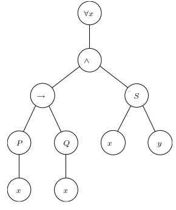
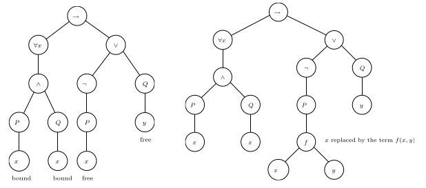
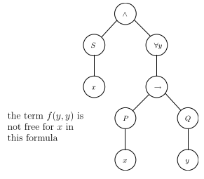

# 2.1 Predicate Logic

Consider the statement "Every student is younger than some instructor" 

- We can't encode "every" and "some" in propositional logic
- Only choice is encode entire statement in an atomic proposition p 
- Improvement: allow "atomic propositions" to be parametric over variables
    - Example: S(X) denotes "x is a student"
- Can reword it to fit it into predicate logic: 
    - Reword to: For every x, if x is a student, then there exists a y such that y is an instructor and x is younger than y
    - This maps to $\forall$x(Student(x) $\implies$ $\exists$y(Instructor(y) $\wedge$ Younger(x,y)))
    - x and y don't have a type (they can represent any possible object) 
    - Predicates are the only way to put constraints on variables

## Soundness and Completeness of Predicate Logic

Will develop predicate calculus (similar to natural deduction) enabling syntactic reasoning with $\vdash$

Will develop semantic entailment for predicate logic, enabling semantic reasoning with $\models$

Similar to propositional logic, we have soundness and completeness of predicate logic:

$\phi$~1~, $\phi$~2~, ..., $\phi$~n~ $\vdash$ $\psi$ if and only if $\phi$~1~, $\phi$~2~, ..., $\phi$~n~ $\models$ $\psi$

*P*: predicate symbols

*F*: function symbols

Each predicate/function symbol has an **arity* denoting how many "parameters" it can apply to. 

Constant (C): is a subset of functions (*C* $\subseteq$ *F*) where the arity is 0. (No parameters) 

Special predicate symbol = $\in$ *P* represnting equality

# 2.2 Predicate Logic as Formal Language

## Terms

Terms represent the basic objects we want to reason about:

> term (t) ::= x | c | f(t,...,t)

- Variables x
- Constants c
- Function symbols f

## Formulas

Formulas: a way of forming statements about the basic objects

> $\phi$ ::= P(t~1~,t~2~,..,t~n~) | $\neg\phi$ | $\phi\wedge\phi$ | $\phi\vee\phi$ | $\phi\implies\phi$ (formula)

> | $\forall$x($\phi$) | $\exists$x($\phi$)

### Example

Encode: "Every daughter of my father is my sister" 

- Represent "me": constant m
- Represent relationship "x is daughter of y": predicate D(x,y)
- Represent relationship "x is a father of y": predicate F(x,y)
- Represent relationshio "x is a sister of y": predicate S(x,y)
- Predicate logic encoding:

>> $\forall$x$\forall$y(F(x,m) $\wedge$ D(y,x) $\implies$ S(y,m))

## Parsing Formulas

Operators precedence is similar to propositional logic

> ($\neg$, $\forall$, $\exists$) (highest), $\wedge$, $\vee$, $\implies$

Implication ($\implies$) is right-associative

## Parse Trees

Formula: $\forall$x((P(x) $\implies$ Q(x)) $\wedge$ S(x,y))

\newpage

## Free/Bound Variables and Substitution

Quantifiers $\forall$x, $\exists$x introduce a *scope* for x (any child after $\forall$x,with an x, will be referencing the original x in the $\forall$)

Quantified variables are bound, otherwise free. 

Use notation $\phi$[t/x] to denote the formula produced by replacing all free occurences of x with t in $\phi$

- $\phi$[f(x,y)/x]: substitution performed on right tree. 

###Capture-avoiding substitution

\
{width=50%}

If you were to perform $\phi$[f(y,y)/x] on the parse tree above, that would break. 

Capture avoidance - need to use a fresh variable y': $\phi$[f(y',y')/x]

# 2.3 Proof Theory of Predicate Logic

Need calculus like natural deduction that let us derive conclusions from premises

Will see that

> $\neg\forall$x($\phi$) $\dashv\vdash$ $\exists$x($\neg\phi$)

## Extending Propositional Logic

Propositional logic = predicate logic limited to 0-ary predicates

Therefore, all we need to full represent predicate is add some extension:

- Terms (specifically, equality between terms)
- Universal quantifiers $\forall$
- Existential quantifiers $\exists$

## Rules for Equality

EQ-INTRO (Introducing =): $\displaystyle \frac{}{t=t}$

EQ-ELIM (Eliminating =): $\displaystyle \frac{t_{1}=t_{2} \text{ } \text{ } \phi[t_{1}/x]}{\phi[t_{2}/x]}$ 

- Can choose however many terms you want to replace with elimination

Example: Equality elimination

> x+1 = 1+x, (x+1 > 1) &rarr; (x+1 > 0) $\vdash$ (1+x) > 1 &rarr; (1+x) > 0

|Step|Formula|Rule|
|----|-------|----|
|1|(x+1) = (1+x)|premise|
|2|(x+1 > 1) &rarr; (x+1 > 0)|premise|
|3|(1+x > 1) &rarr; (1+x > 0)|=e 1,2|

Example: Equality introduction

> t~1~ = t~2~ $\vdash$ t~2~ = t~1~

|Step|Formula|Rule|
|----|-------|----|
|1|t~1~ = t~2~|premise|
|2|t~1~ = t~1~|=i|
|3|t~2~ = t~1~|=e 1,2|

> t~1~ = t~2~, t~2~ = t~3~ $\vdash$ t~1~ = t~3~

|Step|Formula|Rule|
|----|-------|----|
|1|t~2~ = t~3~|premise|
|2|t~1~ = t~2~|premise|
|3|t~1~ = t~3~|=e 1,2|

## Rules for Universal Quantification

ALL-ELIM (Eliminating $\forall$): $\displaystyle \frac{\forall x(\phi)}{\phi[t/x]}$

ALL-INTRO (Introducing $\forall$): $\displaystyle \frac{\text{<}x_{0}\text{>} \text{ ... } \phi[x_{0}/x]}{\forall x(\phi)}$

> \<*x*~0~\> = fresh variables

Example: $\forall$ elimination

> P(t), $\forall$x(P(x) &rarr; $\neg$Q(x)) $\vdash$ $\neg$Q(t)

|Step|Formula|Rule|
|----|-------|----|
|1|P(t)|premise|
|2|$\forall$x(P(x) &rarr; $\neg$Q(x))|premise|
|3|P(t) &rarr; $\neg$Q(t)|$\forall$x e 2|
|4|$\neg$Q(t)|&rarr;e 3,1|

Example $\forall$ introduction

> $\forall$x(P(x) &rarr; Q(x)), $\forall$xP(x) $\vdash$ $\forall$xQ(x)

|Step||Formula|Rule|
|----|-|-------|----|
|1||$\forall$x(P(x) &rarr; Q(x))|premise|
|2||$\forall$xP(x)|premise|
|3|x~0~|P(x~0~) &rarr; Q(x~0~)|$\forall$x e 1|
|4||P(x~0~)|$\forall$x e 2|
|5||Q(x~0~)|&rarr;e 3,4|
|6||$\forall$xQ(x)|$\forall$x i 3-5|

## Rule for Existential Quantification

EX-INTRO (Introduce $\exists$): $\displaystyle \frac{\phi[t/x]}{\exists x(\phi)}$

EX-ELIM (Eliminating $\exists$): $\displaystyle \frac{\exists x(\phi) \text{ } \text{ } \text{ } \text{ }\text{ <}x_{0}\text{> } \phi[x_{0}/x] ... \chi}{\chi}$

Example: $\exists$ introduction

> $\forall$x$\phi$ $\vdash$ $\exists$x$\phi$

|Step|Formula|Rule|
|----|-------|----|
|1|$\forall$x$\phi$|premise|
|2|$\phi$[x/x]|$\forall$x e 1|
|3|$\exists$x$\phi$|$\exists$x i 2

\newpage

Example: $\exists$ elimination

> $\forall$x(P(x) &rarr; Q(x)), $\exists$xP(x) $\vdash$ $\exists$xQ(x)

|Step||Formula|Rule|
|----|-|-------|----|
|1||$\forall$x(P(x) &rarr; Q(x))|premise| 
|2||$\exists$xP(x)|premise| 
|3|x~0~|P(x~0~)|assumption|
|4||P(x~0~) &rarr; Q(x~0~)|$\forall$x e 1|
|5||Q(x~0~)|&rarr;e 4,3|
|6||$\exists$xQ(x)|$\exists$x i 5|
|7||$\exists$xQ(x)|$\exists$x e 2,3-6|

## Quantifier Equivalences 

$\neg\forall$x($\phi$) $\dashv\vdash$ $\exists$x($\neg\phi$)

$\neg\exists$x($\phi$) $\dashv\vdash$ $\forall$x($\neg\phi$)

Other equivalences:

- $\forall$x$\phi$ $\wedge$ $\forall$x$\psi$ $\dashv\vdash$ $\forall$x($\phi$ $\wedge$ $\psi$)
- $\exists$x$\phi$ $\vee$ $\exists$x$\psi$ $\dashv\vdash$ $\exists$x($\phi$ $\vee$ $\psi$)

&nbsp;

- $\forall$x$\forall$y$\phi$ $\dashv\vdash$ $\forall$y$\forall$x$\phi$
- $\exists$x$\exists$y$\phi$ $\dashv\vdash$ $\exists$y$\exists$x$\phi$ 

If x is not free in $\psi$: 

- $\forall$x $\phi$ $\wedge$ $\psi$ $\dashv\vdash$ $\forall$x($\phi$ $\wedge$ $\psi$)
- $\forall$x $\phi$ $\vee$ $\psi$ $\dashv\vdash$ $\forall$x($\phi$ $\vee$ $\psi$)
- $\exists$x $\phi$ $\wedge$ $\psi$ $\dashv\vdash$ $\exists$x($\phi$ $\wedge$ $\psi$)
- $\exists$x $\phi$ $\vee$ $\psi$ $\dashv\vdash$ $\exists$x($\phi$ $\vee$ $\psi$)
- $\forall$x($\psi$ &rarr; $\phi$) $\dashv\vdash$ $\psi$ &rarr; $\forall$x$\psi$
- $\exists$x($\psi$ &rarr; $\phi$) $\dashv\vdash$ $\psi$ &rarr; $\exists$x$\psi$
- $\exists$x($\phi$ &rarr; $\psi$) $\dashv\vdash$ $\forall$x$\phi$ &rarr; $\psi$
- $\forall$x($\phi$ &rarr; $\psi$) $\dashv\vdash$ $\exists$x$\phi$ &rarr; $\psi$

### Clever Trick for Proofs

Think of $\forall$ as $\wedge$

Think of $\exists$ as $\vee$

To prove $\neg\forall$x($\phi$) $\dashv\vdash$ $\exists$x($\neg\phi$)

- First prove $\neg$(p~1~ $\wedge$ p~2~) $\dashv\vdash$ ($\neg$p~1~ $\vee$ $\neg$p~2~)

\newpage

# 2.4 Semantics of Predicate Logic

## Models

Need to extend the propositional logic concept of "valuation"

- Terms (objects that can be many things) need to be mapped to concrete objects
- Function symbols need to be mapped to concrete functions from objects to objects
- Predicate symbols need to be mapped to concrete relations over objects

Model *M* of (*F*,*P*). *F* = function symbol, *P* = predicate symbol: 

- Nonempty set A of concrete objects
- Concrete object g^*M*^ $\in$ A for each 0-arity function symbol g (constant)
- Concrete function f^*M*^: A^n^ &rarr; A for each n-arity function symbol f
- Concrete relation P^*M*^ $\subseteq$ A^n^ for each predicate symbol P

Symbol^*M*^ means symbol is part of the model *M*

Example:

- Concrete objects (states): A = {a,b,c}
- Constant (initial state): i^*M* = a
- Predicate symbol (transition relation): R^*M*^ = {(a,a),(a,b),(a,c),(b,c),(c,c)}
    - There's some state that is reachable from the initial state
- Predicate symbol (final states): F^*M*^ = {b,c}
- Now we can give meaning to formulas:
    - $\exists$y(R(i,y)): y is reachable from the initial state
    - $\neg$F(i): the initial state is not a final state
    - $\forall$x$\exists$y(R(x,y)): For every state, there's a different state that reach any state. 

Example (textbook):

- Given a model *M* for a pair (*F*,*P*) and given an environment *l*, we define the satisfaction relation *M* $\models$ *l*$\phi$ for each logical formula $\phi$ over the pair (*F*,*P*) and look-up table *l* by structural induction on $\phi$. If *M* $\models$ *l*$\phi$ holds, we say that $\phi$ computes to T in the model *M* with respect to the environment *l*. 
- P: If $\phi$ is of the form P(t~1~,t~2~,...,t~n~), then we interpret the terms t~1~,t~2~,...,t~n~ in our set A by replacing all the variables with their values according to *l*. In this way we compute concrete values  a~1~,a~2~,...,a~n~ of A for each of these terms, where we interpret any function symbol f $\in$ *F* by f^*M*^. Now *M* $\models$*l*P(t~1~,t~2~,...,t~n~) holds iff (a~1~,a~2~,...,a~n~) is in set *P^M^*
    - *l* = mapping, universe, every bullet from previous example
    - M $\models$ *l*$\phi$ is for a phi the universe/mapping makes the model true
    - P: apply l environment on concrete objects and thus plug that in into relation P and see if it holds
    - $\forall$ and $\exists$: see if there's something in the mapping where it holds
    - $\neg$, $\wedge$, $\vee$, $\implies$: see if they hold in the mapping
- This is the definition of model in the textbook page 128. It is formal AF, don't think you'll need to know this but idk. 

## Semantic Entailment and Satisfiability

Given set of formulas $\Gamma$:

> $\Gamma$ $\models$ $\psi$ if and only if for all models *M* and lookup tables *l*, whenever *M* $\models$ *l*$\phi$ for all $\phi$ $\in$ $\Gamma$, then *M* $\models$ *l*$\psi$

$\psi$ is satisfiable if and only if there exists some model *M* and lookup table *l* such that *M* $\models$ *l*$\psi$

\newpage

## Theories

Theories give a specific meaning to predicate/function symbols

Theory of equality and uninterpreted function symbols (EUF):

> *F* = {f, ...} (arbitrary function), *P* = {=} (equal predicate)

Theory of Presburger arithmetic: 

> *F* = {0,1,+,-}, *P* = {$\le$}

## Satisfiability Modulo Theories (SMT)

Example (Checking satisfiability): 

- Function: {a * (f(b) + f(c)) = d, b(f(a) + f(c)) $\neq$ d, a = b}
    - Convert times to h
    - Convert plus to g
- New function: {h(a,g(f(b),f(c))) = d,h(b,g(f(a),f(c))) $\neq$ d, a = b}
    - Already unsatisfiable just using EUF

[comment]: # (change the second = d to not = d, bfa+fc = d <<<dis one)

### Lazy SMT

Lazy SMT = DPLL + theory solver

Check satisfiability (Lazy SMT): {a < b $\implies$ a < c, b < c, a < b}

- Encode theory expressions using propositions
    - p $\equiv$ a \< b
    - q $\equiv$ a \< c
    - r $\equiv$ b \< c
- Run DPLL: {p $\implies$ q,r,p}  = {$\neg$p $\vee$ q, r, p}
- Discover satisfying assignment: p = $\top$, q = $\top$, r = $\top$
- Check satisfiability using *theory solver*: {p,q,r} = {a\<b, a\<c, b\<c}
- Theory solver finds satisfying assignment: a=1, b=2, c=3 

