# 3.2 Linear-Time Temporal Logic

Model Checking

- Proof-based (syntactic): $\Gamma$ $\vdash$ $\phi$
- Represent system behaviour using set of formulas $\Gamma$

Theorem Proving

- Model-based (semantic): *M* $\models$ $\phi$
- Represent system behaviour using an abstraction (model) *M*

## Temporal Logic

Can reason about time using predicate logic:

> Use a variable t to represent time in predicates

Alternatively: try to build in the notion of time into the logic

## Linear Temporal Logic (LTL):

- Start with atoms(p,q,r,...), just like in propositional logic
- Reason about the points in time these atoms hold 
- Do this by considering execution paths of a system

### Syntax

LTL Formulas: 

> $\phi$ ::= $\top$|$\bot$|p|$\neg\phi$|$\phi\wedge\phi$|$\phi\vee\phi$|$\phi\implies\phi$|**X**$\phi$|**F**$\phi$|**G**$\phi$|$\phi$**U**$\phi$|$\phi$**W**$\phi$|$\phi$**R**$\phi$ 

Operator precedence:

- $\neg$ (highest)
- **X**
- **F**
- **G**
- **U**
- **R**
- **W**
- $\wedge$
- $\vee$
- $\implies$ (lowest)

Bold letters are temporal operators

- **U** is the only one you need for LTL. It is called the until.
- Can derive the rest from **U**

\newpage

## Transition Systems

A transition system (model) *M* = (S,&rarr;,L) is a set of states S, a (binary) transition relation &rarr; such that every s $\in$ S has some s' $\in$ S with s &rarr; s', and a labeling function L:S &rarr; P (Atoms)

Example:

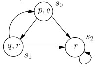

A **path** in a model M = (S,&rarr;,L) is an infinite sequence of states in S such that s~i~ &rarr; s~i+1~. 

- Write the path as s~1~ &rarr; s~2~

## Formulas over Paths

Let *M* = (S,&rarr;,L) be a model

Let $\pi$ = s~1~ &rarr; ... be a path in *M*

Path semantics:

- $\pi$ $\models$ $\top$
- $\pi$ $\not\models$ $\bot$
- $\pi$ $\models$ p if and only if p $\in$ L(s~1~) (This p is for the first set in the trace)
- $\pi$ $\models$ $\neg\phi$ if and only if $\pi$ $\not\models$ $\phi$
- $\pi$ $\models$ $\phi\wedge\psi$ if and only if $\pi$ $\models$ $\phi$ and $\pi$ $\models$ $\psi$
- $\pi$ $\models$ $\phi\vee\psi$ if and only if $\pi$ $\models$ $\phi$ or $\pi$ $\models$ $\psi$
- $\pi$ $\models$ $\phi\implies\psi$ if and only if $\pi$ $\models$ $\phi$ whenever $\pi$ $\models$ $\psi$
- $\phi$ $\models$ **X** $\phi$ if and only if $\pi$^2^ $\models$ $\phi$
- $\phi$ $\models$ $\phi$ **U** $\psi$ if and only if there is some k $\ge$ 1 where $\pi$^k^ $\models$ $\psi$ and $\pi$^j^ $\models$ $\phi$ for all 1 $\le$ j \< k
 
## LTL Semantics

Let *M* = (S,&rarr;,L) be a model

Let s $\in$ S

Let $\phi$ be an LTL formula

We write *M*, s $\models$ $\phi$ to mean:

> For every path $\pi$ of *M* starting at s, we have $\pi$ $\models$ $\phi$

If the model *M* is clear from context, we simply write s $\models$ $\phi$

Talks about a single initial state

## LTL Equivalences 

Future operator: At some point $\phi$ needs to hold

> **F**$\phi$ $\equiv$ $\top$ **U** $\phi$

> {...} &rarr; {...} &rarr; {$\phi$} &rarr; {...} &rarr; ...

Globally operator: Need to always hold at all points in the path (complement of future operator)

> **G**$\phi$ $\equiv$ $\neg$(**F**$\neg\phi$)

> {$\phi$} &rarr; {$\phi$} &rarr; {$\phi$} &rarr; {$\phi$} &rarr; ...

Weak Until operator: Second holds until first

> $\phi$**W**$\psi$ $\equiv$ ($\phi$**U**$\psi$) $\vee$ **G** $\phi$

> {$\psi$} &rarr; ... &rarr; {$\psi$} &rarr; {$\phi$} &rarr; {...} &rarr; ... 

Release operator: Second formula needs to hold till the point the first formula holds with it, then do whatever (like inverse until)

> $\phi$**R**$\psi$ $\equiv$ $\psi$**W**($\phi$ $\wedge$ $\psi$)

> {$\psi$} &rarr; ... &rarr; {$\psi$} &rarr; {$\phi$, $\psi$} &rarr; {...} &rarr; ... 

## LTL Examples

1. "For any state, if a request (of some resource) occurs, then it will eventually be acknowledged" 

> **G**(requested $\implies$ *F* acknowledged)

2. "A certain process is enabled infinitely often on every computation path:"

> **GF** enabled

3. "A certain process will eventually be permanently deadlocked" 

> **FG** deadlock

4. "If the process is enabled infinitely often, then it runs infinitely often"

> **GF** enabled $\implies$ **GF** running

5. "An upwards traveling lift at the second floor does not change its direction when it has passengers wishing to go to the fifth floor"

> **G** (floor2 $\wedge$ directionup $\wedge$ ButtonPressed5 $\implies$ (directionup **U** floor5))

> (Does the above only imply for floor 2, wouldnt it break for any other floor)

## Inexpressible in LTL

Cannot assert the **existence** of a path

- Example: "From any state it is possible to get to a restart state" (there is a path from all states to a state satisfying restart
- To do this "quantification" over paths, we need Computation Tree Logic (CTL)

\newpage

# 3.3 Model Checking

## Modeling Example: Mutual Exclusion

Mutual Exclusion model:

- Each process has **critical sections**
- Only one critical section can execute at a time (no interleaving of critical sections)
- Need a mutual exclusion protocol
- Basic requirements:
    - Safety: at most one critical section can execute at any given time
    - Liveness: request to enter critical section will eventually be granted
    - Non-blocking: a process can always request to enter critical section

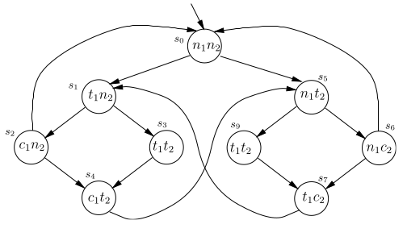{width=90%}

- Safety: **G** $\neg$(c~1~ $\wedge$ c~2~)
- Liveness: **G**(t~1~ $\implies$ **F**c~1~)

## NuSMV Model Checker

```nusmv
    MODULE main
    VAR
        request : boolean;
        state : {ready, busy} 
    ASSIGN
        init(state) := ready;
        next(state) := case
                request : busy; 
                TRUE : {ready,busy} 
            ;esac
    LTLSPEC G(request -> F state = busy)
``` 

# 3.4 Branch-Time Logic

Quantifiers in temporal logic: quantify over paths

- "There exists a path where p eventually holds"

>> $\neg$(**G**$\neg$p) 

- "For all paths, p eventually holds"

>> **GF**p

- This won't work if we have multiple quantifiers ($\forall$ $\exists$)
- Solution: Computation Tree Logic (CTL)

Interpreting formulas over trees

- In LTL, formulas are given meaning with respect to *traces*
- In CTL, formulas are given meaning with respect to a *tree*

## Computation Tree Logic (CTL)

- Start with atoms (p,q,r,...), just like LTL
- Operators **U**, **F**, **G**, **X** are quantified by prefixing either **E** or **A**
- We reason about tree of states produced by executing system
- Transition Systems are the same as LTL

### CTL Syntax

CTL formulas:

> $\phi$ ::= $\top$|$\bot$|p|$\neg\phi$|$\phi\wedge\phi$|$\phi\vee\phi$|$\phi\implies\phi$| **AX**$\phi$ | **EX**$\phi$ | **AF**$\phi$ | **EF**$\phi$ | **AG**$\phi$ | **EG**$\phi$ | **A**[$\phi$**U**$\phi$] | **E**[$\phi$**U**$\phi$] 

Operator precedence:

- $\neg$ (highest)
- \***X**
- \***F**
- \***G**
- \***U**
- $\wedge$
- $\vee$
- $\implies$ (lowest)

\newpage

## CTL Semantics

Let *M* = (S,&rarr;,L) be a model

Let s $\in$ S 

Let $\phi$ be an CTL formula

*M*, s $\models$ $\phi$ means:

- If $\phi$ is atomic, satisfaction is determined by *L*
- If the top-level connective of $\phi$ (the connective occurring top-most in the parse tree of $\phi$) is boolean connective ($\wedge$, $\vee$, $\neg$, $\top$, etc.) then the satisfaction question is answered by the usual truth-table definition and further recursion down $\phi$
- If the top level connective is an operator beginning A, then satisfaction holds if all paths from s satisfy the "LTL formula" resulting from removing the A symbol. 
- Similarly, if the top level connective begins with E, then satisfaction holds if some path from s satisfy the 'LTL formula' resulting from removing the E. 

## Formulas over Trees

Let *M* = (S,&rarr;,L) be a model 

Tree semantics:

- *M*, s $\models$ $\top$ and *M*, s $\not\models$ $\bot$
- *M*, s $\models$ p iff p $\in$ L(s)
- *M*, s $\models$ $\neg\phi$ iff *M*, s $\not\models$ $\phi$ 
- *M*, s $\models$ $\phi$~1~ $\wedge$ $\phi$~2~ iff *M*, s $\models$ $\phi$~1~ and *M*, s $\models$ $\phi$~2~
- *M*, s $\models$ $\phi$~1~ $\vee$ $\phi$~2~ iff *M*, s $\models$ $\phi$~1~ or *M*, s $\models$ $\phi$~2~
- *M*, s $\models$ $\phi$~1~ &rarr; $\phi$~2~ iff *M*, s $\not\models$ $\phi$~1~ or *M*, s $\models$ $\phi$~2~ 
- *M*, s $\models$ AX$\phi$ iff for all s~1~ such that s &rarr; s~1~ we have *M*, s $\models$ $\phi$. Thus, AX says: "in every state" 
- *M*, s $\models$ EX$\phi$ iff for some s~1~ such that s &rarr; s~1~ we have *M*, s $\models$ $\phi$. Thus, EX says: "in some next state". E is dual to A - in exactly the same way that $\exists$ is dual to $\forall$ in predicate logic.
- *M*, s $\models$ AG$\phi$ holds iff for all paths s~1~ &rarr; s~2~ &rarr; s~3~ ..., where s~1~ equals s, and all s~i~ along the path, we have *M*, s~i~ $\models$ $\phi$. Mnemonically: for all computation paths beginning in s the property $\phi$ holds globally. Note that 'along the path' includes the path's initial state. 
- *M*, s $\models$ EG$\phi$ holds iff there is a path s~1~ &rarr; s~2~ &rarr; s~3~ &rarr; ..., where s~1~ equals s, and for all s~i~ along the path, we have *M*,s~i~ $\models$ $\phi$. Mnemonically: there exists a path beginning in s such that $\phi$ holds globally along the path


- *M*, s $\models$ AF$\phi$ holds iff for all paths s~1~ &rarr; s~2~ &rarr; s~3~ &rarr; ..., where s~1~ equals s, there is some s~i~ such that *M*,s~i~ $\models$ $\phi$. Mnemonically: for all computation paths beginning in s there will be some future state where $\phi$ holds 
- *M*, s $\models$ EF$\phi$ holds iff there is a path s~1~ &rarr; s~2~ &rarr; s~3~ &rarr; ..., where s~1~ equals s, and for some s~i~ along the path, we have *M*,s~i~ $\models$ $\phi$. Mnemonically: these exists a computation path beginning in s such that $\phi$ holds in some future state 
- *M*, s $\models$ A[$\phi$~1~ U $\phi$~2~] holds iff for all paths s~1~ &rarr; s~2~ &rarr; s~3~ &rarr; ..., where s~1~ equals s, that path satisfies $\phi$~1~ U $\phi$~2~ ie. there is some s~i~ along the path, such that *M*,s~i~ $\models$ $\phi$~2~ and, for each j < i, we have *M*,s~j~ $\models$ $\phi$~1~. Mnemonically: All computation paths beginning in s satisfy that $\phi$~1~ Until $\phi$~2~ holds on it
- *M*, s $\models$ E[$\phi$~1~ U $\phi$~2~] holds iff there is a path s~1~ &rarr; s~2~ &rarr; s~3~ &rarr; ..., where s~1~ equals s, and that path satisfies $\phi$~1~ U $\phi$~2~ as specified in the previous rule. Mnemonically: there exists a computation path beginning in s such that $\phi$~1~ Until $\phi$~2~ holds on it 

## CTL Examples

- It is possible to get to state where started holds, but ready doesn't 
    - **EF** (started $\wedge$ $\neg$ready) 
- For any state, if a request (of some resource) occurs, then it will eventually be acknowledged:
    - **AG** (requested $\implies$ **AF** acknowledged) 
- The process is enabled infinitely often on every computation path: 
    - **AG** (**AF** enabled) 
- Whatever happens, the process will eventually be permanently deadlocked: 
    - **AF** (**AG** deadlock) 
- From any state it is possible to get to a restart state: 
    - **AG** (**EF** restart)

## CTL Equivalences

- $\neg$**AF**$\phi$ $\equiv$ **EG** $\neg$$\phi$
- $\neg$**EF**$\phi$ $\equiv$ **AG** $\neg$$\phi$
- $\neg$**AX**$\phi$ $\equiv$ **EX** $\neg$$\phi$
- **AF**$\phi$ $\equiv$ **A**[$\top$**U**$\phi$]
- **EF**$\phi$ $\equiv$ **E**[$\top$**U**$\phi$]

## Adequate Sets of Operators

All the CTL operators can be defined using only **AU**, **EU**, and **EX**

# 3.6.1 Model Checking Algorithms

## CTL Model Checking

As humans its easy to reason about all traces, but hard for a computer to reason.

LTL property: G$\neg$(c~1~ $\wedge$ c~2~)

CTL property: AG$\neg$(c~1~ $\wedge$ c~2~)

### CTL Model Checking Problem

- Let *M* = (S,&rarr;,L) be a model
- Model checking: *M*, s $\models$ $\phi$
- Given *M*, $\phi$, we will find a set S' $\subseteq$ S such that *M*, s $\models$ $\phi$ for all s $\in$ S'

Solving the third bullet will allow you to solve the second. (Find all states s where property is satisfied)

### Adequate Sets of Operators

Recall: all the CTL operators can be defined using only **AU**, **EU**, and **EX**

More generally: Set of temporal operators is adequate and only if it contains at least one of {**AX**, **EX**}, at least one of {**EG**, **AF**, **AU**}, and **EU**

Our CTL model-checking algorithm only needs to handle: **AF**, **EU**, **EX**, $\wedge$, $\neg$, $\bot$

- Need three to represent the other operators. (This makes it adequate) 

If the CTL formula is not in this form, first translate it

\newpage

### Label-Based CTL Model Checking Algorithm

- $\bot$: then no states are labelled with $\bot$
- p: then label s with p if p $\in$ L(s)
- $\psi$~1~ $\wedge$ $\psi$~2~: label s with $\psi$~1~ $\wedge$ $\psi$~2~ if s is already labelled both with $\psi$~1~ and with $\psi$~2~
- $\neg\psi$~1~: label s with $\neg\psi$~1~ if s is not already labelled with $\psi$~1~
- AF $\psi$~1~: 
    - If any state s is labelled with $\psi$~1~, label it with AF$\psi$~1~
    - Repeat: label any state with AF$\psi$~1~ if all successor states are labelled with AF $\psi$~1~, until there is no change. (SHOWN IN FIGURE 3)
- E[$\psi$~1~ U $\psi$~2~]: 
    - If any state s is labelled with $\psi$~2~, label it with E[$\psi$~1~ U $\psi$~2~]
    - Repeat: label any state with E[$\psi$~1~ U $\psi$~2~], if it is labelled with $\psi$~1~ and at least one of its successors is labelled with E[$\psi$~1~ U $\psi$~2~], until there is no change. (SHOWN IN FIGURE 4)
- EX$\psi$~1~: label any state with EX$\psi$~1~ if one of its successors is labelled with $\psi$~1~

Complexity: linear in size of the formula, quadratic in the size of the model

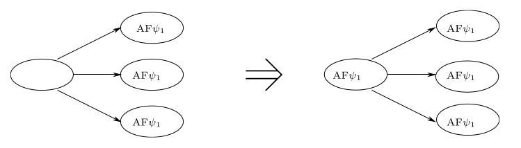

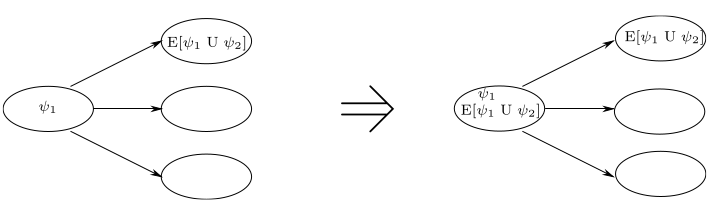

### Handling EG Directly

EG$\psi$~1~: 

- Label all the states with EG$\psi$~1~
- If any state s is not labelled with $psi$~1~, delete the label EG$\psi$~1~
- Repeat: delete the label EG$\psi$~1~ from any state if none of its successors is labelled with EG$\psi$~1~; until there is no change

Translating formula is expensive. Size of the model is big, this will be terrible for the algorithm

Handling EG (Alternative):

- Restrict the graph to states satisfying $\psi$ (delete all other states and their transitions)
- Find the maximal strongly connected components (SCCs); these are maximal regions of the state space in which every state is linked with (= has a finite path to) every other one in that region
- Use backwards breadth-first search on the restricted graph to find any state that can reach an SCC

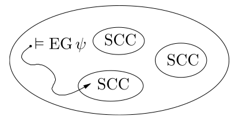{width=50%}

Complexity: linear in both the size of the formula, and the size of the model

### Running label algorithm

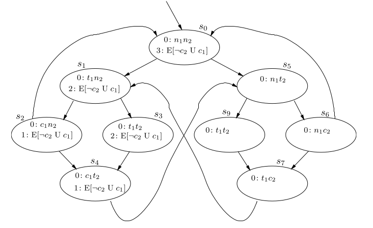{width=80%}

0 1 3 4 &larr; path that satisfy property

With the labeling, if the starting node is labeled, then the property is satisfied

5 6 9 7 &larr; doesn't fit property so it doesnt get label

[comment]: # ( describe the flow of how things are labeled with respect to the algorithm)

## Pre operators

Helper functions for the labeling algorithm

- pre~$\exists$~(Y) = {s $\in$ S: $\exists$s', (s &rarr; s') $\wedge$ $\in$ Y}

> (set of states that **may** transition into Y)

- pre~$\forall$~(Y) = {s $\in$ S: $\forall$s', (s &rarr; s') $\implies$ $\in$ Y}

> (set of states that **only** transition into y

## CTL Labeling: EX

\
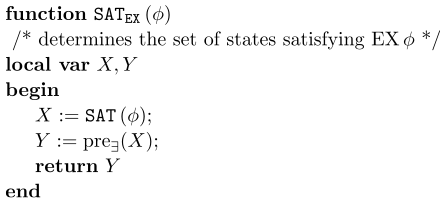{width=50%}

## CTL Labeling: AF

\
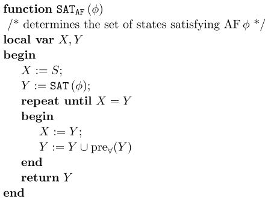{width=50%}

\newpage

## CTL Labeling: EU

\
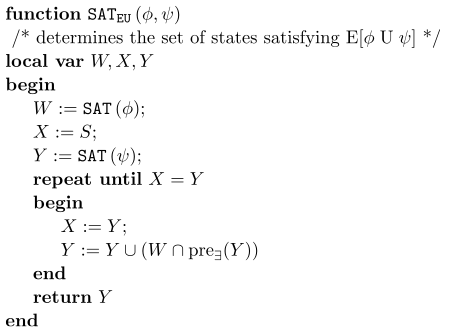{width=50%}

## CTL Labeling Algorithm

\
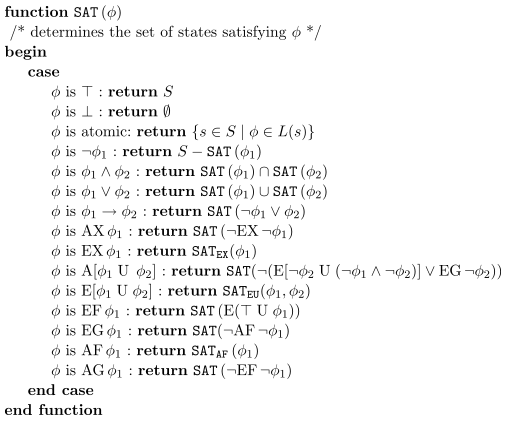{width=65%}

## State Explosion

CTL model checking can be fast (linear), but...

- State space can be huge
- Possible solutions: 
    - Binary decision diagrams (BDDs): represent sets of states
    - Partial order reduction: exploit the fact that some traces can be equivalent with respect to a temporal logic property (can ignore prefixes if two traces end up in the same spot)
    - Composition: decompose problem into easier/smaller subproblems

# 3.6.3 Labeling-Based Algorithm for LTL 

Below is an example of why we **CANT** make a labeling-based algorithm for LTL

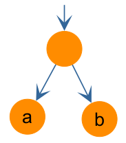{width=20%}

## Basic Idea for LTL Model Checking

LTL model checking: 

1. Construct automaton A~$\neg\phi$~ for $\neg\phi$ (this encodes exactly the traces that don't satisfy $\phi$) 
2. Combine A$\neg\phi$ with the model *M* of the system (resulting in transition system whose paths are both paths of automaton and system) 
- If there is a path in the combined automaton from step 2, output = true
    - path = infinite trace
- If there exists a path (return it as a counter example)a

Step 1 is tricky

Also, you can combine both steps 1 and 2 into a single step

### Example LTL Model Checking

EXAMPLE PROBLEM: LTL $\neg$(a **U** b) 

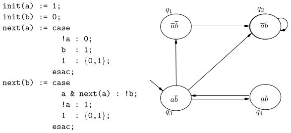{width=80%}

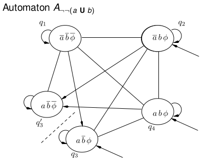{width=

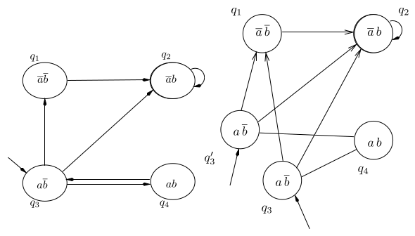

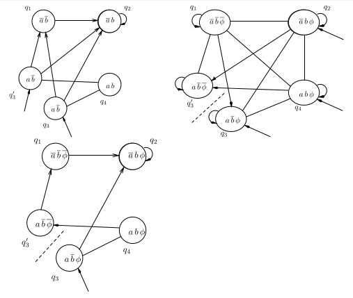

## Combining Model with Automaton

If directed edge exist in both, it exists in combined

If initial state exist in both, it exists in combined


