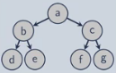

\title{L01 Math and Notation Review}

\maketitle

#Outline:

- Boolean Operators
- Sets
- Languages
- Function and Algebra
- Graphs and Trees
- Recursion
- Theorem and Proofs

# Boolean

> True = 1

> False = 0

## Extended

XOR: when both are true it is false

- 1 $\oplus$ 1 = 0 
- 0 $\oplus$ 0 = 0

# Sets

Set: an unordered collection of objects without repetition (represented with **{}**)

Empty set: {} = $\emptyset$

Common Sets:

- Integers: $\mathbb{Z}$
- Real Numbers: $\mathbb{R}$
- Real Vector: $\mathbb{R}$^n^
- Booleans: $\mathbb{B}$

## Set Builder Notation 

"The set x, such that P(x)" 

> S = { x | P(x) } 

> x = **element**, P(x) = **property**

## Sequences 

Sequence: an ordered list of objects (represented with **( )**)

Tuple: a sequence of finite length

## Subset Relations

Strict/Proper Subset: A $\subset$ B

Equal Subset: A $\subseteq$ A

## Set Complement

Set complement: all elements not in the set

- $\overline{A}$

## Set Difference

Set difference: all elements in A not in B

- A \\ B

## Cartesian Product 

Cartesian Produce, A $\times$ B, is the set of all pairs of elements from A and B

- A $\times$ B  = { (x,y) | (x$\in$A) $\wedge$ (y$\in$B) }

## Power Set 

The power set 2^A^ is the set of all subsets of A, Also written *P*(A)

2^A^ = { x | x $\subseteq$ A } 

This is just the expansion of all possible subsets in set A

# Languages 

Symbol: An abstract, primitive, atomic "thing"

Alphabet: A non-empty, finite set of symbols

String: A sequence over some alphabet

- (h,e,l,l,o): Alphabet is Roman alphabet, can simplify to "hello" 
- Empty string: () = $\epsilon$

Language: A set of strings

\newpage

# Function and Algebra

Function: object creating an input-output relationship (**mapping**) 

Domain: the function's input

Range: the function's output

Notation: Function : domain &rarr; range

## Relations

Binary relation: $\Diamond$ : $\mathbb{X}$ $\times$ $\mathbb{X}$ &rarr; $\mathbb{B}$ 

- Maps two arguments to a boolean
- Properties: 
    - reflexive: true when same arguments
    - irreflexive: false when same arguments
    - symmetric: same if order is flipped 
    - asymmetric: different if order is flipped
    - transitive: multi-step property if a,b holds and a,c holds then a,c holds
- Equivalence: reflexive, symmetric, and transitive

## Algebraic Properties

Commutative: A x B = B x A

Associative: (A x B) x C = A x (B x C)

Distributive: A x (B + C) = (A x B) + (A x C)

# Graphs and Trees

Graph G = (V, E) 

- V: finite set of vertices or nodes
- E: finite set of edges
    - Each edge being a **set** of two vertices

## Directed Graph 

Same as normal graph but each edge is a **pair** (sequence) of two vertices

## Tree

A tree is a graph that:

- Is connected (a path exists between every pair of nodes)
- No cycles

Can use trees to create an abstract representation of expression

- Abstract: Sequence
- Concretely: Array or list
- Abstract syntax trees hehe

## Lists as Symbolic Expression (S-Expressions)

Sequence: (1,2,3,5,8)

List: 1 &rarr; 2 &rarr; 3 &rarr; 5 &rarr; 8 &rarr; NIL

S-Expression: (1 2 3 5 8)

### Trees as S-Expressions

\

(a (b d e) (c f g)) 

# Recursion

Recursion: A function (or other object) defined in terms of itself

- Base Case: Terminating condition
- Recursive Case: Reduction towards the base case

# Theorems and Proofs

Mathematical Statements

- Axiom: a statement assumed to be true 
- Theorem: a mathematical statement proven to be true
- Proposition: a theorem that is obviously true (trivial proof)
- Lemma: a theorem developed to prove another theorem
- Corollary: a theorem that follows from another theorem

Proof: a convincing, absolute logical argument that a statement is true

## Common Proof Types

Proof by Construction: provide an algorithm for the theorem

Proof by Contradiction: assume the theorem is false, and show a false consequence

Proof by Induction: show property holds for successive elements of a set or structure

### Proof by Construction

Theorem: some object exits

Proof: method to construct the object

### Proof by Contradiction

Assume the theorem is false

Show this assumption leads to a false consequence (contradiction)

### Proof by Induction

Basis step: Prove that P(0) is true

Inductive step: Prove that P(i+1) is true

Induction is similar to recursion, can use this to prove recursive algorithms
