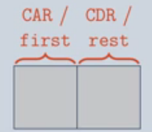
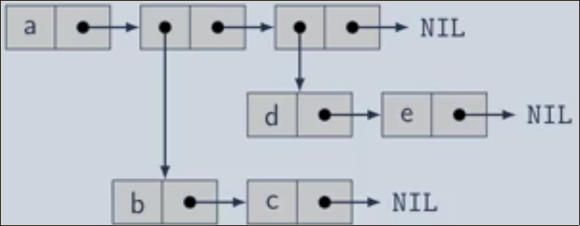
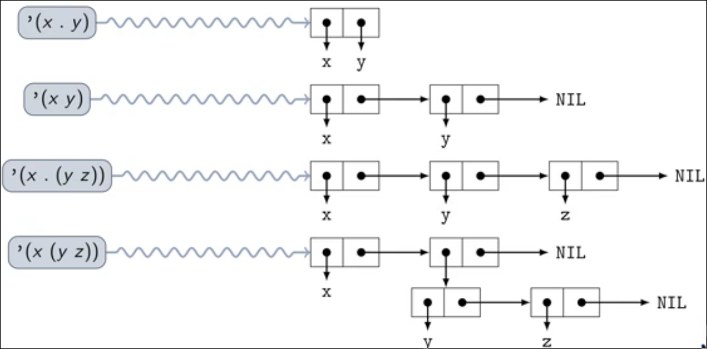

\title{L02 Lisp}
\maketitle

# Lisp

Lisp: a family of programming languages based on s-expressions

- Lisp code can be represented as a list (Code can be represented as **data**)

Why study Lisp?

- Different way of thinking about programming
- Functional programming (lisp has good support)
- Symbolic Computing: manipulating symbolic expressions

# Outline

Symbolic computing 

- Rewrite Systems
- Implementing expressions
- List manipulation

Lisp programming overview

Implementation details

\newpage

# Symbolic Computing

Rewrite system (A **formal system** or **calculus**): a well defined method for mathematical reasoning employing axioms and rules of inference or transformation. 

- Set of rules to transform or rewrite mathematical expressions
- Ex. Given 3x + 1 = 10, find x. You use a rewrite system to obtain x

## Cons Cell 

Cons cell is just a node in a singly-linked list

Declaration:

```
    struct cons { 
        void *first
        struct cons *rest
    }
```

Diagram:

\
{width=20%}

- CAR: data in the node 
- CDR: points to the rest of the list

### Nested Lists

(a (b c) (d e))

\
{width=60%}

Con cells CAR point to a nested list 

\newpage

## Abstract Syntax

In Abstract Syntax we have:

- **Function/Operator**
- **Arguments/Operand**

In Abstract Syntax Tree we have:

- **Root**: Function/operator
- **Children**: Arguments/operand

In S-Expression we have: 
    
- **First**: Root, Function/operator
- **Rest**: Children, Arguments/operand

S-Expression can represent AST

S-Expression can represent list

AST can represent list and vice-versa

## Evaluation and Quoting

Evaluation: Evaluating (executing) an expression and yielding its return value

- Ex. (fun a b) return value of fun
- Ex. (+ 1 2) &rarr; 3

Quoting: Returns the quoted s-expression

- Ex. '(+ 1 2) &rarr; (+ 1 2) 

## List Manipulation 

### Dotted List Notation 

Dotted list notation allows us to define the CAR and CDR of a con cell 

\


### CONStruct Function

Construct a new cons cell:

> **``(cons x y)``**  &rarr; a fresh con cell with x as the CAR (first) and y in the CDR (rest)

If y (CDR) is an existing list, the CDR points to the front of that list

> (cons 2 (cons 1 NIL)) = Con cell 2 pointing to con cell 1 to NIL

### List Function 

List: return a list containing the supplied objects

> **``(list a0 ... an)``** &rarr; a list containing objects a~0~, ..., a~n~

### List Access

Con Cells = \[CAR]\[CDR]

&nbsp;

CAR: returns the car of a cons cell

> (car cell) &rarr; the CAR (first) of cell

CDR: returns the rest of a cons cell 

> (cdr cell) &rarr; the CDR (rest) of cell

### List Template Syntax

Backquote ('): Create a template 

> '(x~0~ ... x~n~) &rarr; (list 'x~0~ ... 'x~n~)

> Ex. '(+ a (\* b c)) &rarr; ( + a ( \* b c))

Comma (,): Evaluate and insert

> '($\alpha$ ... **y** $\beta$) &rarr; (list $\alpha$ ... **evaluated y** $\beta$)

> Ex. '(+ a ,(\* 2 3)) &rarr; (+ a 6)

Comma-At (,@): Evaluate and splice

> '($\alpha$ ... ,@**y** $\beta$) &rarr; (append $\alpha$ ... **spliced y** $\beta$) 

> Ex. '(+ a ,@(list (\* 2 3) (\* 4 5))) &rarr; (+ a 6 20)

\newpage

# LISP Programming Overview

Format: 

> C: printf("hello, world\\n");

> LISP: ``(format t "hello, world ~%")``

## Booleans and Equality: 

| Math | Lisp | Notes | 
|:----:|:----:|:------|
|False | nil  | equivalent to empty list () |
|True  | t    | or any non-nil value |
|$\neg$a|(not a)||
|a = b |(= a b)| numerical comparison|
|a = b |(eq a b)| same object ("physical equality")|
|a = b |(eql a b)| same object, same number and type, or same character|
|a = b |(equal a b)| eql objects, or lists/arrays with equal elements |
|a = b |(equalp a b)| = numbers, or same character (case-insensitive), |
|      |            | or recursively-equalp con cells, arrays, structures, hash tables|
|a $\not$= b|(\= a b)| numerical inequality|
|a $\not$= b|(not (eq a b)) | and similarly for other equality functions|

## Relations and operators are what you expect it to be

> (or a b), (+ 2 3), (< 4 5), etc...

## Function Definition

```
    (defun function_name (arguments)
        (+ n 1))
``` 

## Conditionals

> If statements:

```
        (if (clause)
            true
            false)
```

> Conditional statement (similar to switch cases)

```
        (cond
            ((clause 1) (do this))
            ((clause 2) (do this)))
```

\newpage

## Local Variables

LET and LET\* create and initialize new local variables. LET operates in "parallel" and LET\* operates sequentially. 

&nbsp;

```
    (let ((a 0)) [operation])
    ;; If the operation had two things it were doing, it would do both at the same time
```
&nbsp;

```
    (let* ((a 0)) [operation])
    ;; If the operation had two things it were doing, it would do the first, and then the second
```

&nbsp;

Example:

```
    (let ((a 1)) 
        (let ((a 2) (b a))
            (print (list a b))
        )
    )

;; Output would be (2 1)


    (let ((a 1)) 
        (let* ((a 2) (b a))
            (print (list a b))
        )
    )
;; Output would be (2 2)
```
\newpage

# Implementation Details

