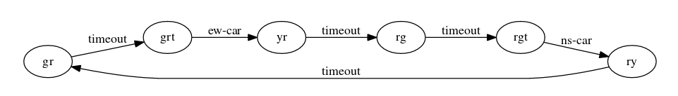
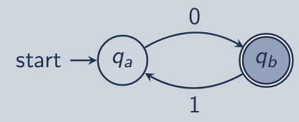
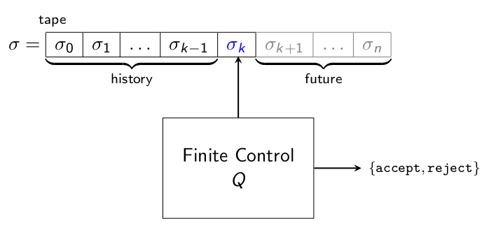

\title{Finite Automata}
\maketitle

# Introduction

Finite Automata: a model of computation with finite state (memory) 

- Application: text processing, program verification, compilers

# Outline

- Languages and Automata
    - Definitions
    - Example

- Deterministic Finite Automata (DFA)

- Nondeterministic Finite Automata (NFA)

# Language and Automata

## Definitions

Symbol: An abstract, primitive, atomic "thing" 

Set: An unordered collection, without repetition

Alphabet: A non-empty, finite set of symbols

- Ex. $\sum_{B}$ = {0, 1} alphabet of booleans

[comment]: <> (_)

Sequence: An ordered list of objects

- Ex. (1, 2, 3, 5, 8, ...)

String: A sequence over some alphabet

- Ex. hello (if the alphabet is our actual alphabet)

Languages: A set of strings

\newpage

## Example Automata

States: 

- NS = {red, yellow, green} (cars going north and south)
- EW = {red, yellow, green} (cars going east and west)
- timeout = {0, 1} (timer on the traffic light)

Events:

- Q = {timeout, ns-car, ew-car}

Transition Table:

| State | timeout | ns-car | ew-car |
|:-----:|:-------:|:------:|:------:|
| gr    | grt     | -      | -      | 
| grt   | -       | -      | yr     |
| yr    | rg      | -      | -      |
| rg    | rgt     | -      | -      |
| rgt   | -       | ry     | -      |
| ry    | gr      | -      | -      |

# Deterministic Finite Automata (DFA)

Deterministic Finite Automata: a 5-tuple: M = (Q, $\sum$, $\delta$, q~0~, F), where:

- Q is a finite set called the **states**
- $\sum$ is a finite set called the **alphabet**
- $\delta$ : Q $\times$ $\sum$ &rarr; Q is the transition function
- q~0~ $\in$ Q is the start state
- F $\subset$ Q is the set of accept states

Example:

> \
{width=35%}

- Q = {q~a~, q~b~}
- $\sum$ = {0, 1}
- $\delta$(q~a~, 0) = q~b~, $\delta$(q~b~, 1) = q~a~
- q~0~ = q~a~ 
- F = {q~b~}

\newpage

## Conceptual DFA Operation

M : $\Sigma$\* &rarr; {accept, reject}

\
{width=70%}

Can represent a DFA as a machine with 

- Finite Control state Q
- $\sigma$ which is an input string (tape)
- At the end of the string two things can happen:
    1. **Accept** reach end of tape (string) with control in accept state q $\in$ F
    2. **Reject** reach end of tape (string) with control not in accept state q $\not\in$ F

With this representation we could say the **language** of M is the set of strings accepted by M.

Meaning a DFA can produce a set of strings that end with an accepting state

## Symbolic DFA Semantics

Transition Functions: transition from state q~pred~ to q~succ~ on symbol $\sigma$

> $\delta$(q~pred~, $\sigma$) = q~succ~

Extended Transition Function: transition from state q~0~ to q~n~ on string *w*

> base: $\delta$(q, $\epsilon$) = q

> recursive: For a $\in$ $\Sigma$ and *B* $\in$ $\Sigma$\*,

>>>> $\hat\delta$(q, a*B*) = $\hat\delta$($\delta$(q, a), *B*)

## DFA Simulation

Input: DFA M and Input String *w*

Find: Does M accept the input string

Algorithm:

    1. Evaluate the extended transition function on input string *w*
    2. At the end of the input string:
        - If the resulting state is an accept state, return accept
        - Otherwise, return reject
    
    Dumdum: Go through the states given the string transition, if it ends with accept then we good. 

## DFA Language Definitions

Acceptance: DFA M **accepts** string *w* when the extended transition function results in an accept state:

> $\hat\delta$(q~0~, *w*) $\in$ F

Rejection: DFA M **rejects** string *w* when the extended transition function results in an non-accept state:

> $\hat\delta$(q~0~, *w*) $\not\in$ F

Recognition: DFA M **recognizes** the language *L*(M) consisting of the set of strings accept by M: 

> *L*(M) = {*w* | $\hat\delta$(q~0~, *w*) $\in$ F} 

## Regular Languages

Regular Languages (*R*): are languages that can be recognized by DFAs

> *R* = {L | for some DFA M, L = *L*(M)}

A language (L) is regular if and only if there exists a DFA (M) that recognizes it:

> (L $\in$ *R*) $\leftrightarrow$ $\exists$M, (L = *L*(M))

# Nondeterministic Finite Automata (NFA)

Nondeterministic Finite Automata: a 5-tuple: N = (Q, $\sum$, $\delta$, q~0~, F), where:
 
- Q is a finite set called the **states** 
- $\Sigma$ is a finite set called the **alphabet**
- $\delta$: Q $\times$ $\Sigma$ &rarr; *P*(Q) is the transition function
- q~0~ $\in$ Q is the start state
- F $\subseteq$ Q is the set of accept states

## NFA VS DFA

- DFA can only transition to a single state, NFA can transition to multiple states
- NFA cannot represent more languages than DFA

Proof that NFA cannot represent more languages than DFA:

1. Each nondeterministic step of an NFA, we are in a set of states
2. All such sets are the powerset of NFA states *P*(Q~NFA~)
3. The powerset of a finite set is still a finite set
4. We can create a DFA who's states correspond to *P*(Q~NFA~)

 
