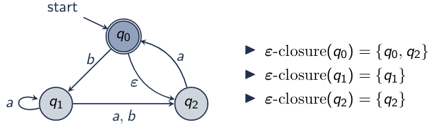

\title{Subset Construction}
\maketitle

# Introduction

- DFA and NFA both represent regular languages
- Equivalent DFA using subsets of NFA states

# Outline

- $\epsilon$ Closures
    - $\epsilon$-closure
    - move-$\epsilon$-closure

- NFA Simulation

- Subset Construction Algorithm

# $\epsilon$ Closures

**$\epsilon$-closure(q)**: states reachable from q on $\epsilon$ transitions

**move-$\epsilon$-closure**: states reachable from state q after reading symbol $\sigma$

## $\epsilon$-closure
 
{width=65%}

Idea:

- Input: initial set of states
- Output: set of states (the closure) reachable only on $\epsilon$ transitions
- Approach: recursively visit states and "accumulate" the $\epsilon$-closure

>> Base case: Visiting a state already contained in the $\epsilon$-closure (set of states)

>> Recursive case: Add the current state and recurse on all its $\epsilon$-neighbors

## move-$\epsilon$-closure

{width=69%}

Idea:

- Input: initial state set Q and input symbol $\sigma$
- Output: set of states reachable from Q after reading $\sigma$ (any number of $\epsilon$-transitions are allowed)
- Approach: 
    1. Find $\epsilon$-closure of initial set Q
    2. Find set of states after reading the symbol $\sigma$ 
    3. Find $\epsilon$-closure of resulting set
- Note: move first and then do epsilon

# NFA Simulation

- Input: NFA N and Input String *w*
- Outline: Does N accept the input string *w*
- Algorithm Outline:
    1. Compute $\epsilon$-closure of start state as the current state (subset)
    2. While the input string contains more symbols:
        
        2.1 Read the next input symbol

        2.2 Compute the move-$\epsilon$-closure from the current state (subset)
        
        2.3 Update the current state (subset)
    3. At the end of the input string: 
        
        If the current state (subset) contains an accept state, return accept
        
        Otherwise, return reject

# Subset Construction Algorithm

Subset Construction: NFA to DFA

- Input: NFA
- Output: Equivalent DFA
- Algorithm Outline: Recursively visit subsets, beginning with $\epsilon$-closure of the start state
    1. If the current subset was already visited, return
    2. For each symbol $\sigma$ in alphabet $\Sigma$, find move-$\epsilon$-closure from the current subset on $\sigma$
    3. Add the resulting subsets and edges, then recursively visit

[\[LINK\]: Converting NFA to DFA ez mode](https://www.youtube.com/watch?v=taClnxU-nao)

Practical usage of DFAs VS NFAs

- If we have an NFA:
    1. Simulate NFA by tracking all possible current states (subsets)
    2. Convert NFA to DFA by constructing the subsets of NFA state set

 

