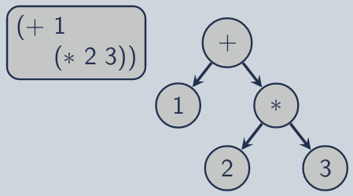

\title{Regular Expression}
\maketitle

# Introduction

Regular Expressions

- Automata match set of strings (the language)
- Regular expression: convenient representation to specify and compose regular languages
- Mathematical expressions consisting of operations (functions) on regular languages that result in regular languages
- Widespread use in text processing

# Expressions

## Arithmetic Operations and Expressions

Arithmetic Expressions:

- Operations on numbers, that result in a number:

>> op: $\mathbb{R}$ $\times$ ... $\times$ $\mathbb{R}$ &rarrl; $\mathbb{R}$

- Recursive construction of expressions:

>> Base: atomic/literal number (leaves)

>> Recursive: operator and arguments (subtrees)

{width=50%}

\newpage

## Mathematical Closure

Definition: a set is **closed under** some operation if both the domain and range of the operation are composed of that set. 

- Unary: T : S &rarr; S

>> (S is closed under T)

- Binary: W : S $\times$ S &rarr; S
   
>> (S is closed under W)

- Dumdum: given inputs and an operation to be performed, if the output is the same type as the input, it is closed under that operation

Examples:

- Integers are closed under addition
- Booleans are closed under not
- Counterexample: Integers are NOT closed under division

# Regular Expressions

## Regular Operations and Expressions

Regular Operator: an operator under which the regular languages are closed: 

> op: *R* $\times$ ... $\times$ *R* &rarr; *R*

Recursive construction of expressions: 

- Base: atomic regular language
- Recursive: regular operator and arguments

Example:

- Union is a regular operator (union of two regular languages gives you another regular language)

## Regular Language Basis

Empty set: $\emptyset$ defines the language {}, containing no members

Empty string: $\epsilon$ defines the language {$\epsilon$}, containing the empty string

Single symbol: any single symbol a $\in$ $\Sigma$ defines the language {a}, containing the string (a)

### Expression VS Language

| Regular Expression | Language |
|:------------------:|:--------:|
| $\emptyset$        | *L*($\emptyset$) = {} | 
| $\epsilon$         | *L*($\epsilon$) |
| a                  | *L*(a) | 

\newpage

## Regular Operators

union(a, b): the union a|b denotes all members of *L*(a) and *L*(b): 

> *L*(a|b) = *L*(a) $\cup$ *L*(b) = {x | x $\in$ *L*(a) $\vee$ x $\in$ *L*(b)}

concatenation(a, b): the concatenation ab denotes *L*(a) followed by *L*(b): 

> *L*(ab) = {xy | x $\in$ *L*(a) $\wedge$ y $\in$ *L*(b)}

kleene-closure(a): The kleene-closure (or repetition) a\* denotes zero or more repetitions of *L*(a)

> *L*(a\*) = {x~0~ ... x~n~ | (n $\ge$ 0) $\wedge$ (x~i~ $\in$ *L*(a))}

Precedence:

3. Kleen-closure (highest/tightest) 
2. Concatenation
1. Union (lowest/last)

## Identity Elements

Identity element: a special element of a set for which a binary operation on that set leaves any element unchanged 

> f(x, *e*) = x (*e* is the identity element)

Example: 

In addition:

> x \* 1 = x

> 1 is the identity element

## Algebraic Properties

Union:

- Commutative: *L*(a|b) = *L*(b|a)
- Associative: *L*((a|b)|y) = *L*(a|(b|y))

Concatenation:

- Not commutative
- Associative: *L*((ab)y) = *L*(a(by))

Distributivity:

- Concatenation distributions over union *L*(a(b|y)) = *L*(ab|ay)
