---
geometry: margin=2cm
--- 

\title{Regular Expressions and Automata}
\maketitle

# Introduction

Regular expressions: convenient to specify a text pattern 

Finite automata: efficient to match a text pattern

Both are equivalent

# Outline

- Regular Expressions to NFA 
    - Illustration 
    - Algorithm

- NFA to Regular Expressions

# Regular Expressions to NFA

Regex and NFA:

- To say they are equivalent, the **langauge** produced by the regex ***L*(R)** must be equal to the **language** produced by the NFA ***L*(N)**. 

Given a Regex, we need to convert the following parts into NFA

- Basis Regular Expressions:
    - Empty set
    - Empty string
    - Input symbol
- Regular Operations: 
    - Concatenation
    - Union
    - Kleene-Closure

\newpage

## Basis Regular Expressions: 

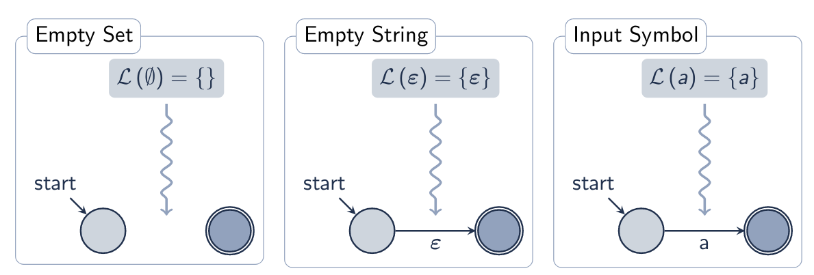{width=75%}

## Regular Operations: 

Before handling operations, convert the basis regular expressions into a NFA using the conversions shown in figure 1. 

Example:

> Given REGEX: e~1~e~2~e~3~\*, where e~i~ are expressions

> Convert each e~i~ to NFAs so that they are N~1~, N~2~, N~3~

> Then handle the concatenation of N~1~ and N~2~ and the Kleene Closure of N~3~

### Concatenation 

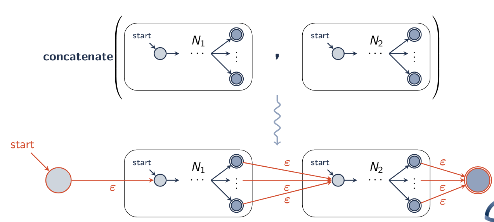

\newpage

### Union

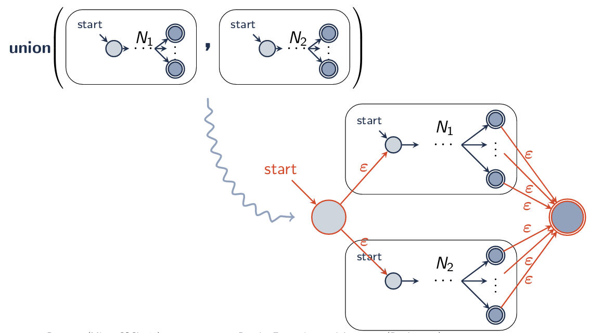{width=90%}

### Kleene

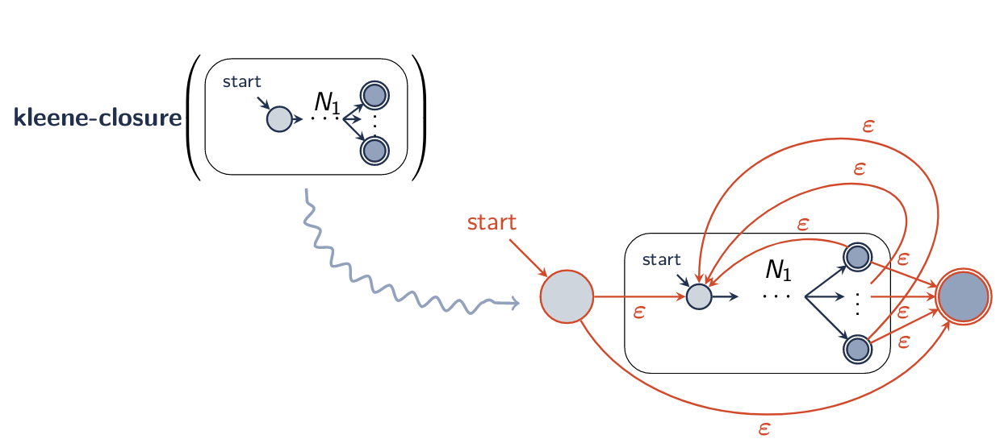{width=92%}

\newpage

## Abstract Syntax of Regular Expressions

\
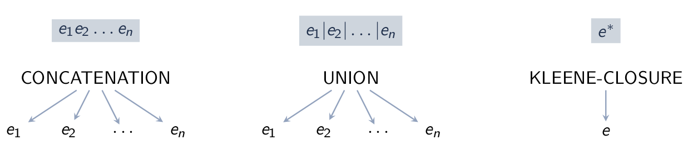

Concatenation &rarr; **(:concatenation e-1 ... e-n)**

Union &rarr; **(:union e-1 ... e-n)**

Kleene &rarr; **(:kleene e)**

## McNaughton-Yamada-Thompson Algorithm

Input: A regular expression R

Output: The equivalent NFA N, where *L*(R) = *L*(N)

Overview: Recursive construction:

> Base case: If R is a basis element ($\emptyset$, $\epsilon$, a) construct the equivalent NFA directly

> Recursive case: Otherwise, recurse on the children of R and combine the results according to the operation of R

\
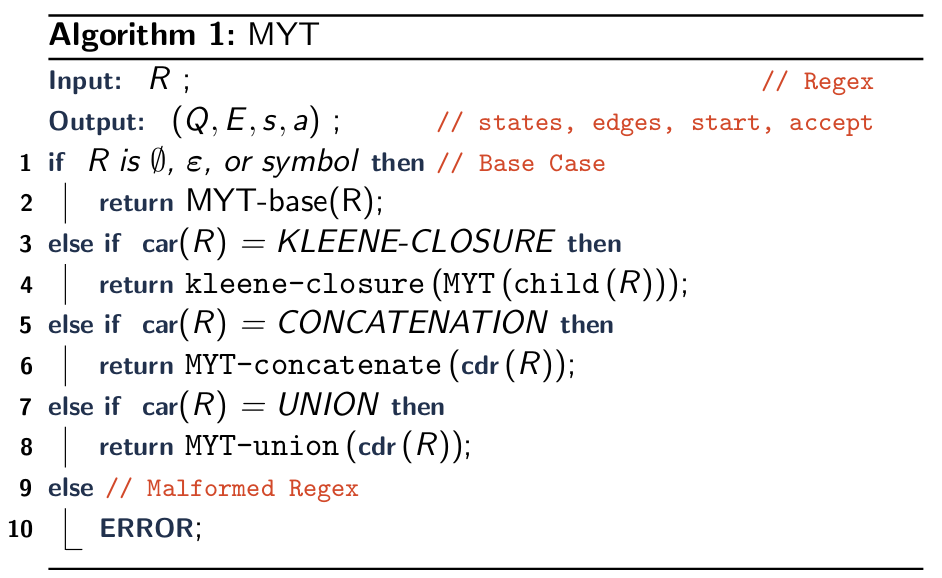

\newpage

\
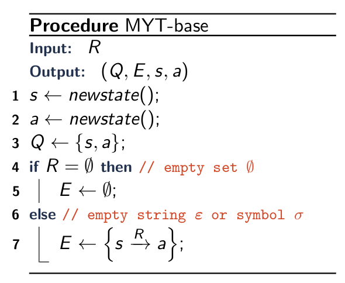{width=50%} 

\
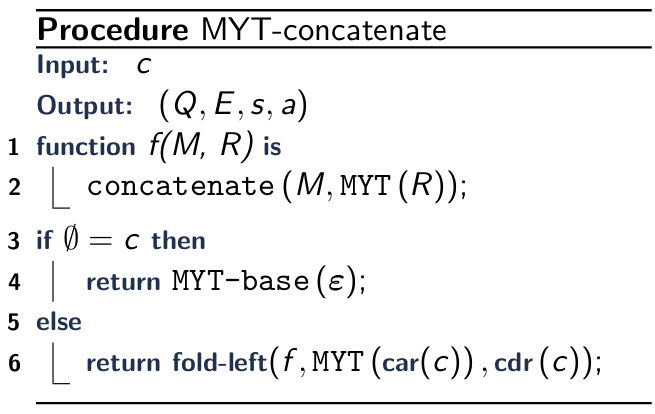{width=50%} 
 
\
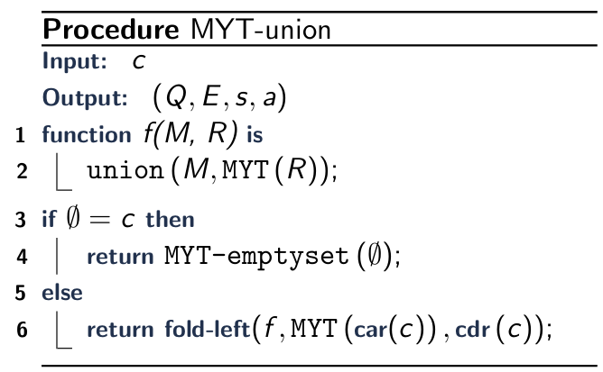{width=50%} 

\newpage

# NFA to Regular Expressions

Input: NFA N

Output: Equivalent regular expression R, 

> *L*(N) = *L*(R)

Approach: Construction generalized NFA: an NFA with regular expressions on its edges
    1. Convert N to an initial GNFA
    2. Iteratively remove (rip) states from the GNFA
    3. When the GNFA has only two states (start and accept), the edge between them is the equivalent regular expression

## Generalized NFA (GNFA)

A generalized NFA $\tilde{N}$ = (Q, $\Sigma$, $\delta$, q~start~, q~accept~):

- Q is the finite set of states
- $\Sigma$ is the input alphabet 
- $\delta$: (Q \ {q~accept}) $\times$ (Q \ {q~start~}) &rarr; REGEX
- q~start~ $\in$ Q is the start state
- q~accept~ $\in$ Q is the accept state 

## Ripping a state from the GNFA

Ripping is taking a section of the GNFA and converting it into a regex

- Given: state~i~ &rarr; state~rip~ &rarr; state~j~
- Convert: state~i~ &rarr; state~j~ where the transition is the regex

Ripping state $\tilde{q}$ 
    
- Predecessor state q~i~
- Successor state q~j~ 

Four types of edges: 

- Predecessor E(q~i~, $\tilde{q}$)
- Successor E($\tilde{q}$, q~j~)
- Loop E($\tilde{q}$, $\tilde{q}$) 
- Bypass E(q~i~, q~j~)

All predecessor/successor pairs

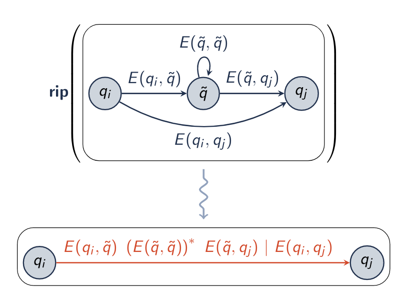{width=45%} 

## NFA to Regular Expression Algorithm

\
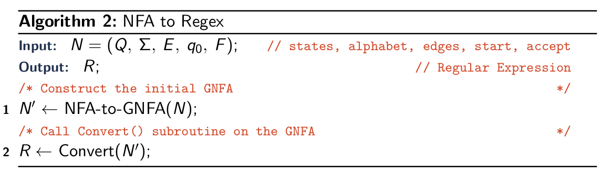{width=90%}

&nbsp;

&nbsp;

\
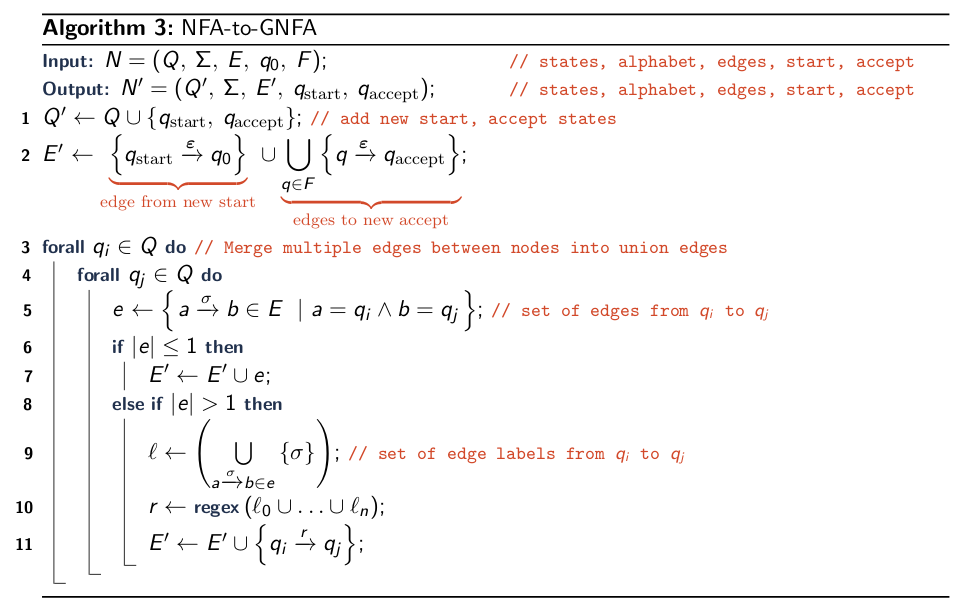

\newpage

\
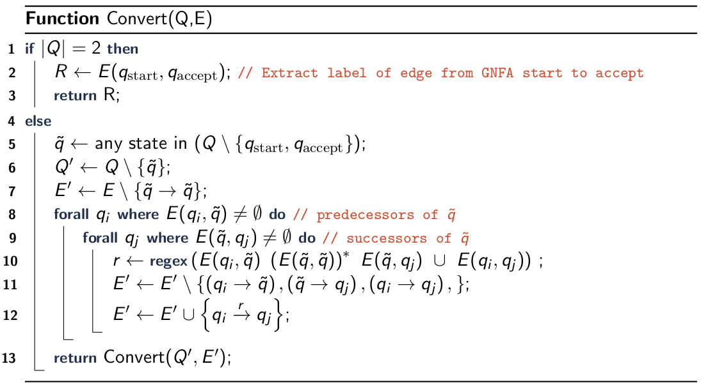

# Equivalence 

\
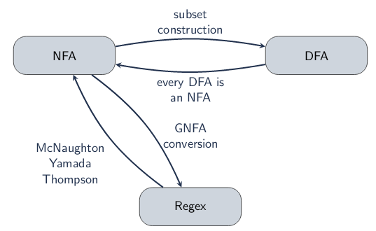
