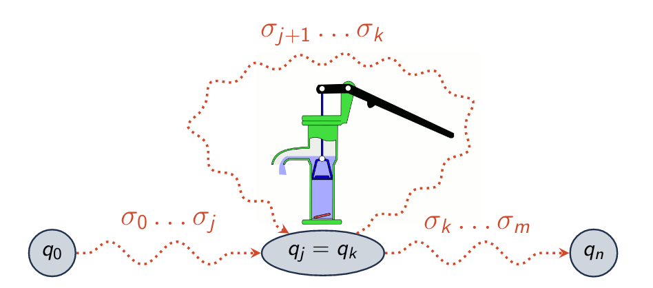

\title{Pumping Lemma For Regular Languages}
\maketitle

# Introduction

Pumping Lemma:

- We can write regular expressions and simulate NFA/DFA for regular languages
- Are all languages regular (**no**)
- How do we know if a language is regular (and we should try to think of a regular expression) or not regular (and we should try something else)?

# Pumping Lemma Intuition

Pumping Lemma: Prove nonregularity, based on a property of all regular languages 

- Any string in the language longer than the *pumping length* can be *pumped*
- Dumdum: in a finite automaton, if there is a section which can be repeated an arbitrary number of times, it is nonregular. 

\newpage

# Theorem: Pumping Lemma

Theorem (Pumping Lemma): If A is a regular language, there is a number p (the pumping length) where if: 

- $\sigma$ $\in$ A 
- |$\sigma$| \> p 

then we can divide $\sigma$ into three pieces $\sigma$ = xyz such that: 

- for each i $\le$ 0, xy^i^z $\in$ A (we can pump y)
- |y| \> 0
- |xy| $\le$ p
- y would be the "pump" from figure 1

## Proof Outline

Proof:

- A = *L*(M) and M = (Q, $\sigma$, $\delta$, q~0~, F) 
- Assume p = |Q|
- Pigeonhole Principle: 
    - p pigeonholes and more than p pigeons
    - some hole has more than one pigeon
- For $\sigma$ $\in$ A, if |$\sigma$| = n, we visit n+1 states of a DFA to accept $\sigma$
- If |$\sigma$| \> p, we must revisit some state

Essentially, we have so many states, if our string is larger than the number of states, we have to revisit some states, which in theory would allow you to do that infinitely. 

# Using Pumping Lemma to Prove A Language is Not Regular

Proof by contradiction:

> Theorem: language L is not regular

> Proof outline:
    
> - Assume L is regular (has to fulfill the three pumping conditions)

>> - for each i $\le$ 0, xy^i^z $\in$ A (we can pump y)
>> - |y| \> 0
>> - |xy| $\le$ p

> - Choose some $\sigma$ that is in L such that |S| $le$ p

>> - $\sigma$ is divided into xyz

> - Show all the ways $\sigma$ can be divided into xyz
> - Prove that for each divided way, you can't satisfy the 3 conditions
> - $\sigma$ can't be pumped. Proved by contradiction. QED.

\newpage

## Pumping Lemma Proof Example

Theorem:

> Let L = {0^n^1^n^ | n $\ge$ 0}. L is not regular

Proof: 

1. Assume L is regular and apply pumping lemma
2. $\sigma$ = 0^p^1^p^ = xyz
3. Three divisions
    
    3.1. y = 0...0, pumping y would result in more 0's than 1's which isnt in L
    
    3.2. y = 1...1, pumping y would result in more 1's than 0's which isnt in L
    
    3.3 y = 0...01...1, pumping y would result in 010101 or something similar, this cant be in L 

4. Contradiction, L is not regular

## Common False Steps in Applying Pumping Lemma

"I declare that the pumping length p = 5" 

- A regular language must have some constant p, but we do not know what that p is based only on the fact that a language is regular. Need to treat p symbolically when using the pumping lemma to prove nonregularity 

"I found a string I could pump. Therefore the language is regular"

- Dun goofed, could exist some other string that can't be pumped

" I couldn't find a string that, when pumped, was not in the language. Therefor, the language is regular"

- Get smart and find one, bitch

[LINK: understanding](https://www.youtube.com/watch?v=dikEDuepOtI)
