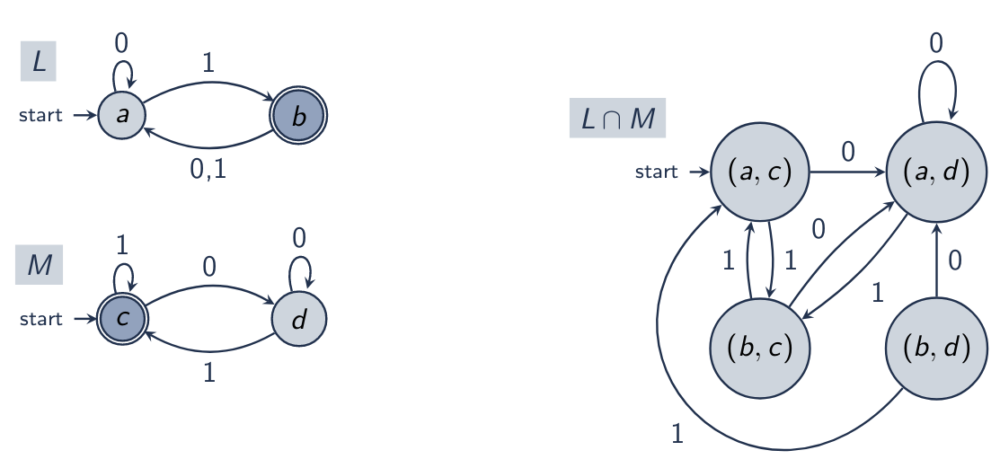

---
geometry: margin=2cm
--- 

\title{Closure Properties of Regular Languages}
\maketitle

# Introduction

Closure properties

- Closure properties let us compose languages
- Useful to specify / model

# Outline

- Reverse
- Complement
- Intersection
- Difference

# Reverse

Input: Finite Automaton A

Output: Finite Automaton R where *L*(R) = {$\sigma$~0~...$\sigma$~n~ | $\sigma$~n~...$\sigma$~0~ $\in$ *L*(A)}

Solution 

1. Reverse edges of A
2. Start state of A becomes new accept state
3. New start state with $\epsilon$ transitions to old accept states

\

\newpage

## Reverse Algorithm

\
{width=80%}

## Reverse on Regular Expressions

Input: Regular Expression A

Output: Reverse of A, denoted as A^R^

Solution: Inductive Construction

> Basis: For symbol $\alpha$ being a $\in$ $\Sigma$, $\epsilon$, or $\emptyset$:

>> $\alpha$^R^ = $\alpha$

> Induction: For $\alpha$^R^ in:

>> Concatenation: ($\beta\gamma$)^R^ = $\gamma$^R^$\beta$^R^

>> Union: ($\beta$|$\gamma$)^R^ = $\beta$^R^ | $\gamma$^R^

>> Kleene-closure: ($\beta$\*)^R^ = ($\beta$^R^)\*

\newpage

## Regex Reverse Algorithm

\

# Complement

Input: Regular Languages A

Output: $\bar{A}$ = {$\sigma$ | $\sigma$ $\not\in$ A}

Solution: Flip accept / non-accept states

\

## Dead States

Need to include dead states when taking the complement as they become accepts states in the conversion process. 

\
{width=30%}

# Intersection

Input: Regular Languages A = *L*(M~A~) and B = *L*(M~B~)

Output: C = {$\sigma$ | ($\sigma$ $\in$ A) $\wedge$ ($\sigma$ $\in$ B)}

Solution: Use the product DFA to find C = *L*(M~C~)

> M~C~ accepts when both M~A~ and M~B~ accept

> F~C~ = {(q~i~, q~j~) $\in$ Q~C~ | q~i~ $\in$ F~A~ $\wedge$ q~j~ $\in$ F~B~}

\

## Intersection Algorithm

\

For E' you are recursively visiting the product states. 

## Intersection Visit Product States Algorithm

\

\newpage

# Difference

Input: Finite Automaton M~A~ and M~B~ 

Output: Finite Automaton M~D~ where

> *L*(M~D~)  = L(M~A~) / *L*(M~B~) = {$\sigma$ | $\sigma$ *L*(M~A~) $\wedge$ $\sigma$ $\not\in$ *L*(M~B~)

Solution: Use product DFA

> Final states where M~A~ accepts and M~B~ does not

> F~D~ = {(q~a~, q~b~) $\in$ Q~D~ | (q~a~ $\in$ F~A~) $\wedge$ (q~b~ $\not\in$ F~B~)}

Difference: is the intersection of the DFA except one of them is the complement

\

