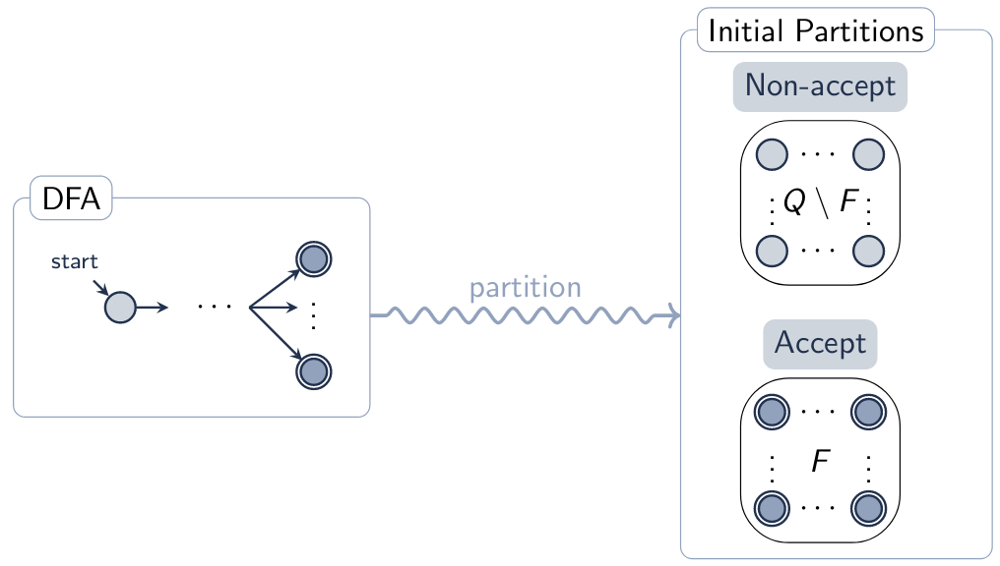
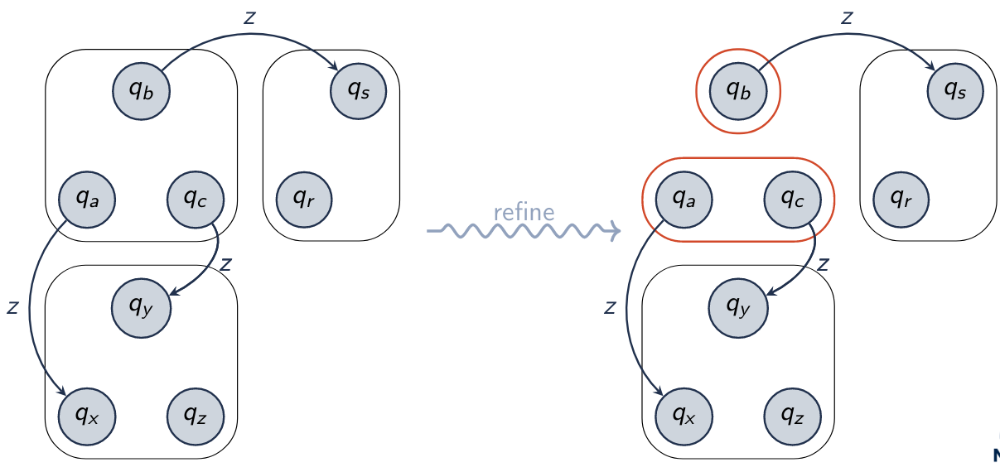
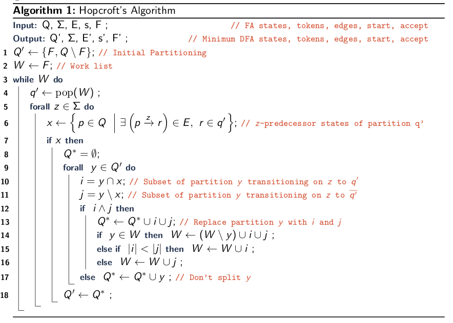
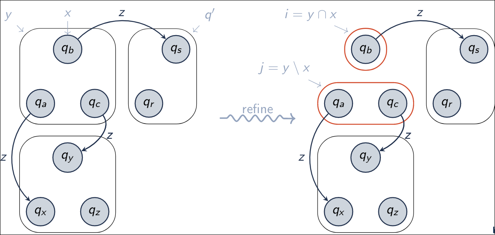
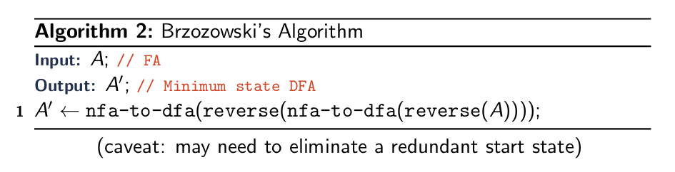

---
geometry: margin=2cm
--- 

\title{Minimization of Finite Automata} 
\maketitle

# Introduction 

Canonical DFA (Minimum State DFA) 

- For each state q~A~ in Q~A~ and q~B~ in Q~B~, there must exist $\sigma$ $\in$ $\Sigma$\* such that, 
    - Without such $\sigma$, we could remove q~A~ or q~b~ to find a smaller automaton
    - q~A~ will correspond with q~B~
- |Q~A~| = |Q~B~| and DFA A and B are isomorphic

Two minimizing algorithms

1. John Hopcroft (Hot cross buns)
2. Janusz (John) Brzozowski

# Outline

- Hopcroft's Algorithm
- Brzozowski's Algorithm
- Comparison

# Hopcroft's Algorithm

Fixed Point: the fixed point of a function is a value where the function's input and output are equal 

- For f: X &rarr; X, the fixpoint is some value x $\in$ X where f(x) = x

Hopcroft's Algorithm Outline:

- Input: DFA M
- Output: Minimal DFA M', such that *L*(M') = *L*(M)
- Algorithm: Repeatedly refine partitions until reaching a fixpoint: 
    1. Partition states initially into accept F and non-accept Q / F
    2. Repeatedly refine partitions:

>>> 2.1. If partition p contains states that transition to different successor partitions on symbol s. 

>>> 2.2. Split p into new sub-partitions where all states in each sub-partition transition to the same successor partition on s
    
>   3. Repeat the refinement until reaching the fixpoint (no further refinements possible)

\newpage

{width=80%}

&nbsp;

&nbsp;

b was split from a and c because they pointed to different partitions

\newpage

## Hopcroft's Algorithm (Detailed)

\

\newpage

# Brzozowski's Algorithm

\

# Hopcroft's VS Brzozowski's

| | Hopcroft | Brzozowski | 
|--|---|---|
| Input | DFA | DFA or NFA| 
| Worst-case runtime | O(k n ln n) | exponential (P(Q)) | 
| Average-case runtime | O(k n ln n) | "pretty good" | 

n = |Q| (number of states) 
k = |$\Sigma$| (size of alphabet)
