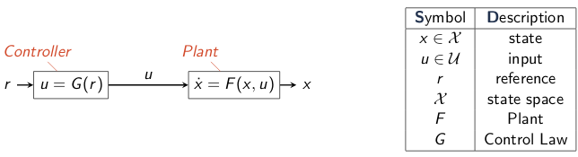
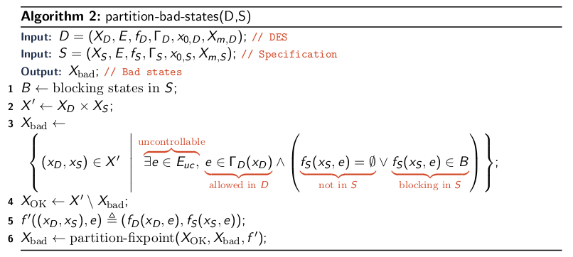

\title{Discrete Event Systems}
\maketitle

# Introduction

Discrete Event System (DES): a system that exhibits discrete (non-continuous change) 

The control engineer's view of language and automata theory

Application

- Embedded systems
- Robotics
- Verification

# Outline

- Introduction to Control 
- Discrete Event Systems Models
- DES Languages & Properties
- Supervisory Control 

# Introduction to Control

{width=70%}

{width=70%}

# Discrete Event System Models

Discrete Event System: a discrete-state, event-drive system. That is, its state evolution depends entirely on the occurrence of asynchronous discrete events over time. 

D = (X, E, f, $\Gamma$, x~0~, X~m~): 

- X is the set of states
- E is the finite set of events
- f: X $\times$ E $\mapsto$ X is the transition function
- $\Gamma$: X $\mapsto$ P(E) is the active event function
- $\Gamma$(x) = {e $\in$ E | f(x,e) is defined}
- x~0~ is the initial state
- X~m~ is the set of marked states

# DES Languages & Properties

## Extended Transition Function

Transition Function f: X $\times$ E $\mapsto$ X 

Extended Transition Function $\hat{\text{f}}$: X $\times$ E\* $\mapsto$ X

- Base: $\hat{\text{f}}$(x, $\epsilon$) = x
- Inductive: $\hat{\text{f}}$(x, $\alpha$e) = f($\hat{\text{f}}$(x, $\alpha$), e), where $\alpha$ $\in$ E\* and e $\in$ E
 
Define **transitions** recursively over strings

## Language Marked

The language marked by D = (X, E, f, $\Gamma$, x~0~, X~m~) is the set of strings that take D to a final marked state:

> *L*~m~(D) = {s $\in$ E\* | $\hat{\text{f}}$(x~0~, s) $\in$ X~m~}
 
Different word for **acceptance**

## Language Generated for DES

The language generated by D = (X, E, f, $\Gamma$, x~0~, X~m~) is the set of string that have defined transitions in D: 

> *L*~g~(D) = {s $\in$ E\* | $\hat{\text{f}}$(x~0~, s) is defined}

**Behaviour** that is possible; but not necessarily "acceptable" 

## Prefix Closure

The prefix closure of language L is the set of all prefixes of strings in L: 

> $\widetilde{\text{L}}$ = {$\alpha$ $\in$ E\* | $\beta$ $\in$ E\*, $\alpha\beta$ $\in$ L}

where E is the event set (alphabet) for L. 

### Prefix Closure Algorithm

\
{width=80%}

## Example

{width=75%}

## DES Language and Prefix Relations

Every marked string is also a prefix of the marked language: 

> *L*~*m*~(*D*) $\subseteq$ $\widetilde{L_{m}(D)}$

Every marked string can be generated: 

> *L*~*m*~(*D*) $\subseteq$ *L*~*g*~(*D*)

Every prefix of a marked string can be generated

> $\widetilde{L_{m}(D)}$ $\subseteq$ *L*~*g*~(*D*)

## Deadlock

Automaton reaches a state from which no further execution is possible:

## Live Lock

Automaton reaches a cycle from which a marked (accept) state is not reachable

## Blocking

An automaton D is **blocking** if it can deadlock or livelock. An automaton D is **nonblocking** if neither deadlock nor livelock are possible 

> Blocking: we can generate a string that is not a prefix to a marked state

> Nonblocking: every string we can generate is a prefix to a marked state

\newpage

# Supervisory Control

## Supervisor Function

Supervisor Function: S: *L~g~* (D) $\mapsto$ *P*(E)

- Dynamically enable/disable events in E 
- Restricts the DES to desirable behavior
- For a model DES (FA) it basically gets rid of transitions (thus supervising the possible transitions)

Supervisor functions are languages

## Supervised Generation 

Supervised Generation: *L~g~* (S/D)

- Basis: Contains the empty string: 

>> $\epsilon$ $\in$ *L~g~*(S/D) 

- Inductive: Next event e in recursively-allowed string $\sigma$ is allowed by the supervisor:

>> ($\sigma$e $\in$ *L~g~*(S/D)) $\leftrightarrow$ (($\sigma$ $\in$ *L~g~*(S/D)) $\wedge$ ($\sigma$e $\in$ *L~g~*(D)) $\wedge$ (e $\in$ S($\sigma$))) where e $\in$ E and $\sigma$ $\in$ E\*

## Supervised Marking

Supervised Marked: *L~m~*(S/D)

> *L~m~*(S/D) = *L~m~*(D) $\cap$ *L~g~*(S/D)

## Supervised Language Relations

Unsupervised:

> *L~m~*(D) $\subseteq$ $\widetilde{L_{m}(\text{D})}$ $\subseteq$ *L~g~*(D)

Supervised:

> $\emptyset$ $\subseteq$ *L~m~*(S/D) $\subseteq$ $\widetilde{L_{m}(\text{S/D})}$ $\subseteq$ *L~g~*(S/D) $\subseteq$ *L~g~*(D)

## Supervised Blocking

Blocking: *L~g~*(S/D) $\not$= $\widetilde{L_{m}(\text{S/D})}$ 

[comment]: (asdfjakl_)

- Generated strings **not** prefixes of marked strings
- Can generate unmarked strings

Nonblocking: *L~g~*(S/D) = $\widetilde{L_{m}(\text{S/D})}$ 

[comment]: (asdfjakl_)
 
- **All** generated strings are prefixes of marked strings

Supervise to restrict generation to marked prefixes

\newpage

## Supervision Example

## Specifications

Express desired behaviour using specifications

Represent (specify) language of acceptable/admissible behavior

System should only generate admissible behavior

Example:

> Given E = {x, y, z}

> A specification of "DONT DO X" would produce the following regex:

>> (y|z)\*

\newpage

## Controllable and Uncontrollable events

Controllable Events: Events we can prevent

Uncontrollable events: Events we cannot prevent

### Fully Controllable Case

All events are controllable

Supervision is a direct intersection operate:

> *L~g~*(S/D) = *L~g~(D) $\cap$ *L*(S)

> Use product automaton to find the intersection

### Partially Controllable Case

Some events are uncontrollable

A simple synthesis algorithm:

1. Find "bad" states: 
    - base: disallowed and blocking states in S
    - recursive: states with uncontrollable transitions to "bad" states
2. Avoid "bad" states

## Fixed Point

Fixed point of a function is a value where the function's input and output are equal. 

> For *f*: X $\mapsto$ X, the fixpoint is some value x $\in$ X where f(x) = x

## Bad State Algorithm

\

## Partition Fixpoint Algorithm

\

