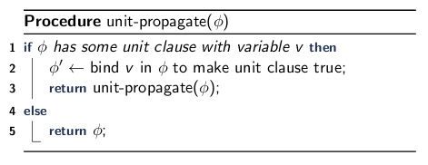

\title{Boolean Satisfiability}
\maketitle

# Introduction

Satisfiability (SAT): can we satisfy a boolean formula

- Is NP hard
- Can be reduced to many other hard problems

# Outline

- SAT Problem
- Conjunctive Normal Form
    - N-ary Operators
    - Definitions
    - Conversions
- Davis-Putnam-Logemann-Loveland

# SAT Problem

Input: A boolean formula:

- Variables P = p~1~ ... p~n~
- Formula $\phi$: $\mathbb{B}$^n^ $\mapsto$ $\mathbb{B}$

Output: Is $\phi$(P) satisfiable?

- $\exists$P, ($\phi$(P) = $\top$)
- What is P?

Example: 

- Input: 
    - P $\equiv$ {a, b}
    - $\phi$ $\equiv$ a $\implies$ ($\bot$ $\vee$ b)
- Output: 
    - SAT, a = $\bot$

# Conjunctive Normal Form

## N-ary Boolean 

AND: $\alpha$ $\wedge$ $\beta$ = (``AND`` $\alpha$ $\beta$)

OR: $\alpha$ $\vee$ $\beta$ = (``OR`` $\alpha$ $\beta$)

## Identity Element

Identity Element: a special element of a set for which a binary operation on that set leaves any element unchanged 

> f($\alpha$, $\chi$) = $\alpha$

Arithmetic Example:

> a * $\chi$ = a, if $\chi$ = 1

Boolean Example:

> a $\wedge$ $\chi$ = a, if $\chi$ = $\top$

## Cancellation and the Identity Element

If we have variables that are the identity element (i.e. variable + identity = variable) we can just remove the variable that are the identity elements

## Normal Forms

Normal Form: a standard or conventional way of writing a mathematical object

In rewrite systems: an object that cannot be further rewritten 

\*Often useful to define algorithms in terms of some normal form

## Definitions

Literal: a single variable or its negation

- positive literal: p
- negative literal: $\neg$p

Conjunction: An n-ary AND. True when **all** of its arguments are true. Examples:

- p~i~ $\wedge$ p~j~
- p~i~ $\wedge$ (p~j~ $\vee$ p~k~)

Disjunctions: An n-ary OR. True when **any** of its arguments are true. Examples:

- p~i~ $\vee$ p~j~
- p~i~ $\vee$ (p~j~ $\wedge$ p~k~)

## Conjunctive Normal Form (CNF)

A conjunction of disjunctions of literals

(**S-expression representation**):

> **(**and (or l~0,0~, l~0,1~ ...)

>> &nbsp;(or l~1,0~, l~1,1~ ...) 

>> &nbsp;...

>> &nbsp;(or l~n,0~, l~n,1~ ...)**)**

> where each l~i,j~ is a literal, that is one of p or (NOT p) 

(**Infix representation**):

> (p~i~ $\vee$ p~j~) $\wedge$ ($\neg$p~i~ $\vee$ p~k~)

### Conversion to CNF

1. Eliminate $\Longleftrightarrow$

>> ($\alpha \Longleftrightarrow \beta$) $\rightsquigarrow$ ($( \alpha \implies \beta ) \wedge (\beta \implies \alpha )$)

2. Eliminate $\implies$

>> ($\alpha \implies \beta$) $\rightsquigarrow$ ($\neg\alpha \vee \beta$)

3. Eliminate $\oplus$

>> ($\alpha \oplus \beta$) $\rightsquigarrow$ (($\alpha$ $\vee$ $\beta$) $\wedge$ $\neg$($\alpha$ $\wedge$ $\beta$))

4. Move in $\neg$ 

>> Double negation: ($\neg$($\neg\alpha$)) $\rightsquigarrow$ ($\alpha$)

>> De Morgan's Law: ($\neg$($\alpha \wedge \beta$)) $\rightsquigarrow$ (($\neg\alpha \vee \neg\beta$))

>> De Morgan's Law: ($\neg$($\alpha \vee \beta$)) $\rightsquigarrow$ (($\neg\alpha \wedge \neg\beta$))

>> At this point, this is called Negation Normal Form (NNF)

5. Distribute $\vee$ over $\wedge$: ($\alpha \vee$ ($\beta \wedge \gamma$)) $\rightsquigarrow$ (($\alpha \vee \beta$) $\wedge$ ($\alpha \vee \gamma$))

>> ($\alpha \vee$ ($\beta \wedge \gamma$)) $\rightsquigarrow$ (($\alpha \vee \beta$) $\wedge$ ($\alpha \vee \gamma$)

# David-Putnam-Logemann-Loveland (DPLL)

DPLL Outline: For $\phi$ in conjunctive normal form:

> Base Case: 

> 1. If $\phi$ has all true clauses ($\forall$), return true
> 2. If $\phi$ has any false clauses ($\exists$), return false

> Recursive Case: 

> 1. Propagate values from unit (single-variable) clauses. 
> 2. Choose a branching variable v
> 3. Branch (recurse) for v = 1 or v = 0

## Unit Clauses

A disjunction in the conjunctive normal form that contains only a single, positive, or negative literal.

- Example: a, $\neg$ba

Unit propagation example:

> Given (a $\wedge$ (a $\vee$ b) $\wedge$ ($\neg$b $\vee$ c))

> if a = 1, we can convert the formula into ($\neg$b $\vee$ c)

\newpage

### Unit Propagation Algorithm

\
{width=70%}

Steps:

1. Find a unit clause
2. Propagate assignment
3. Recurse

## DPLL Algorithm

\
{width=75%}

Steps:

1. Propagate unit clauses
2. If formula is true or false, return
3. Pick some variable v:

    3.1. Try Recursing with true v

    3.2. If unsat, try recursing with false

### DPLL Example

