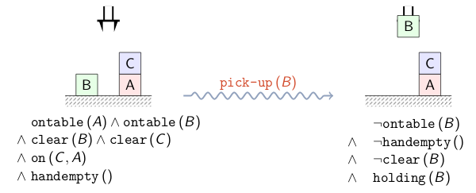
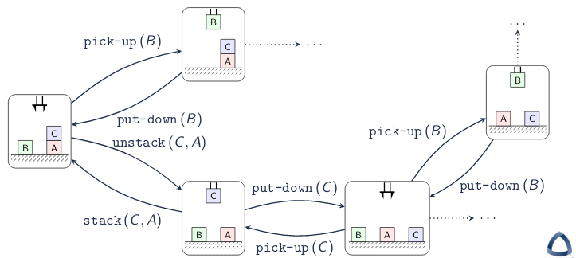

\title{Planning as Satisfiability (SAT PLAN)}
\maketitle

# Introduction

Planning: find a sequence of actions from a state state to a goal state

SATPlan: reduction to SAT is a fast approach for planning

- Relates closely to the Cook-Levin theorem and NP-Completeness

# Outline

- Introduction to Planning
- Planning Domains
    - First-Order Logic
    - Planning Domain Description Language
- SATPlan

# Introduction Planning

Planning Problem:

> Given: A planning domain consisting of:

> - State Space: Q = f~0 $\times$ f~1~ $\times$ ... $\times$ f~m~ for each fluent (state variable) f~i~

> - Actions: U = {a~0~, ..., a~n~}

> - Transitions: $\delta$: Q $\times$ U $\mapsto$ Q

> - Start: q~0~ $\in$ Q is the initial state

> - Goal: G $\subseteq$ Q is the set of goal states 

> Find: A plan consisting of a sequence of actions (transitions) from start to goal

\*Note: State space isn't completely identical to FA representation of states. Planning has way more states than we could possibly enumerate. Therefore planning requires efficient way to search these large spaces.

\newpage

# Planning Domains

## First-Order Logic

Propositional Logic Plus: 

> Objects: instead of just Boolean values

> - Finite set of values
> - Enumerated type

> Predicates: Function from objects to Booleans

> - P: O $\times$ ... $\times$ O $\mapsto$ $\mathbb{B}$

> Functions: Function form objects to objects

> - F: O $\times$ ... $\times$ O $\mapsto$ O

> Quantifiers: express properties on collections

> - Universal: all items have the property
> - Existential: at least one item has the property

## Logical Predicate (First Order Logic)

Logical Predicate: a boolean-valued function

Example:

- "x is happy" $\rightsquigarrow$ happy(x)
- "The suitcase contains a bomb" $\rightsquigarrow$ contains(suitcase, bomb)
- "x is less than y" $\rightsquigarrow$ less(x, y)

## Planning Actions

Planning action: atomic symbol that changes the world state

Action precondition: the valid predecessor states

Action effect: The successor state

\newpage


### Planning Action Example: Pick Up

\
{width=75%}

Parameters: ?x (any arbitrary object)

Precondition: clear(?x) $\wedge$ ontable(?x) $\wedge$ handempty()

Effect: $\neg$ontable(?x) $\wedge$ $\neg$clear(?x) $\wedge$ $\neg$handempty() $\wedge$ holding(?x)

## Task Language




## Planning Domain Definition Language (PDDL)

PDDL: S-expression based format for planning domains

Operator file: File that defines all predicates and actions

Facts file: File that defines the objects (constants), start state, and goal

### PDDL: Operator

```
(define (domain blocks)
    (:predicates (on ?x ?y) (ontable ?x) (clear ?x) (handempty) (holding ?x))

    (:action pick-up :paramters (?x)
        :precondition (and (clear ?x) (ontable ?x) (handempty))
        :effect (and (not (ontable ?x)) (not (clear ?x)) (not (handempty)) (holding ?x))

```

### PDDL: Facts

```
(define
    (problem name)
        (:domain blocks)
        (:objects a b c)
        (:init (on c a)
               (ontable a) 
               (ontable b)
               (clear c)
               (clear b)
               (handempty))
        (:goal (and (on b c)
                    (on a b))))
```

- The start is 3 boxes where c is on top of a and b is by itself
- The goal is having 3 boxes where a is on b which is on c

# SATPlan

First-Order vs. Propositional logic: every sentence in first-order logic can be converted into an equivalent sentence in propositional logic (with modulo functions)

## Grounding (First-Order Logic Reduction to Propositional Logic)

Objects: 

- {glass, steel}

Predicates: 

- transparent(?x)
- denser(?x, ?y)

Propositions: 

- transparent(glass) $\rightsquigarrow$ transparent-glass
- transparent(steel) $\rightsquigarrow$ transparent-steel
- denser(glass,steel) $\rightsquigarrow$ denser-glass-steel

## Planning as Boolean Satisfiability

1. Ground first-order logic domain (PDDL) to propositional logic
2. Encode planning problem as Boolean formula:
    - Unroll for fixed steps, n
    - One boolean variable per state/action per step
3. If SAT: return action variable assignments
4. Else: increment n and repeat

### Unrolling Example

First-Order Logic:

- Objects: A,B,C
- Predicate: ontable(?x)

Propositional Logic:

- ontable-A
- ontable-B
- ontable-C

Unrolled (for fixed value n=3 steps)

- ontable-A-0
- ontable-B-0
- ontable-C-0
- ontable-A-1
- ontable-B-1
- ontable-C-1
- ontable-A-2
- ontable-B-2
- ontable-C-2


 
 


