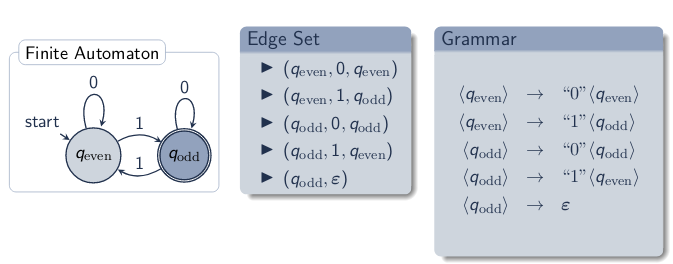
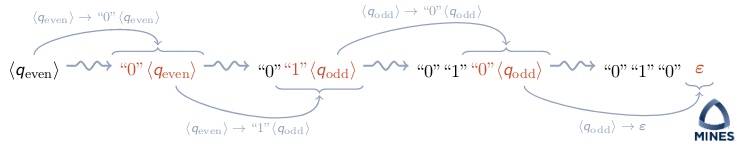
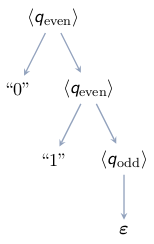

\title{Context-Free Grammars}
\maketitle

# Introduction

Two views on grammars:

1. Grammars are rules defining the structure between symbols and clauses in a language
2. Grammars define mathematical transformation between symbols and clauses in a language

Using Grammars: generation and parsing

- Generation: using the grammar to produce strings in the language
- Parsing: using the grammar to accept or reject strings in the language, and also often to identify the structure in the string

Grammars: recursive representation of structure of a formal language 

# Outline

- Finite Automata and Grammars 
- Context-Free Grammars
- Natural Language Grammars

# Finite Automata and Grammars 

Edge set: The edge set E for a DFA is E = {(q~i~, $\sigma$, q~j~) | q~j~ = $\delta$(q~i~, $\sigma$}

> This is essential the edge parameter for ``make-fa`` in project 1

For accept states, add edge (q~a~, $\epsilon$) where q~a~ is an accepting state

{width=80%}

## Backus-Naur Form

Using example from figure 1: here is the respective BNF grammar:

> \<q~even~\> &rarr; "0" \<q~even~\>, "1" \<q~odd~\>

> \<q~odd~\> &rarr; "0" \<q~odd~\>, "1" \<q~even~\>, $\epsilon$

Grammar Parts

- Terminal: Atomic, input symbol (Ex. "0")
- Nonterminal: Can replace with multiple elements (Ex. \<q~odd~\>)
- Production: Rewrite or substitution rule (Ex. \<q~even~\> &rarr; "0" \<q~even~>

## Generation Using Grammars

1. Begin: with a sequence containing starting nonterminal
2. Repeat: replace some nonterminal in the current sequence with a right-hand side for that nonterminal
3. Terminate: when no nonterminal are left in the sequence, i.e., we have a string of terminals

## Parse Trees

- Leaves: Terminals
- Interior Nodes: Nonterminals
- Edges: Rewrite (Replacement) of a nonterminal

\
{width=20%}

If we added an edge from 1 state to itself (plus quotations), we would have infinite grammar and infinite trees. This could cause our parse tree to create infinite quotations. We can ignore this with context free grammar. 

# Context-Free Grammar

Context-Free Grammar: A context-free grammar G is the tuple G = (V, T, P, S), where: 

- V is a finite set of variables or nonterminals
- T is a finite set of terminals
- P is a finite set of productions in the form V &rarr; (V $\cup$ T)\*
- S $\in$ V is the start symbol 

### Example

Grammar: 

> \<e> &rarr; "(" \<e> ")", $\epsilon$

Corresponding Context-Free Grammar: 

> - V = {\<e>}
> - T = {"(", ")"}
> - P = {(\<e> &rarr; "("\<e>")"), (\<e> &rarr; $\epsilon$)}
> - S = {\<e>}

## Context-Free Grammar: Language of a Grammar

The language of CFG G = (V, T, P, S), denoted *L*(G), is the set of terminal strings that have derivations from the start symbol S, 

> *L*(G) = {$\omega$ $\in$ T\* | S $\rightsquigarrow$ $\omega$}

## What is "Context Free"

Rewriting nonterminals is independent of surrounding context. Meaning when we expand a nonterminal in the CFG, it won't duplicate unnecessary terminals. 

### Example: Infix Arithmetic

T = { + , - , \* , $\div$ , number , variable , ( , ) }

Grammar: 

- \<e> &rarr; \<e> \<op> \<e> | "("\<e>")" | "number"|"variable"
- \<op> &rarr; +|-|\*|$\div$

Issue with this grammar: 

> If we try to construct a parse tree for a + b \* c. We could have two representations. This is called an **ambiguous grammar** 

\newpage

# Natural Language Grammars 

Grammar for English subset: 

> \<sentence> &rarr; \<noun-phrase>\<verb-phase> 

> \<noun-phrase> &rarr; \<noun> | \<adjective>\<noun-phrase> | \<article>\<noun-phrase> 

> \<verb-phrase> &rarr; \<verb> | \<verb>\<adverb>
