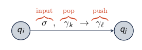
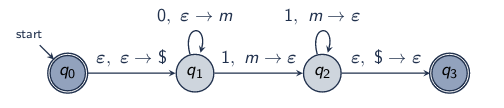
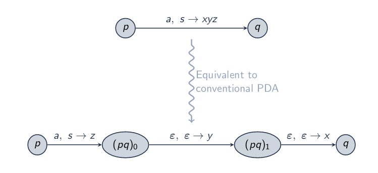
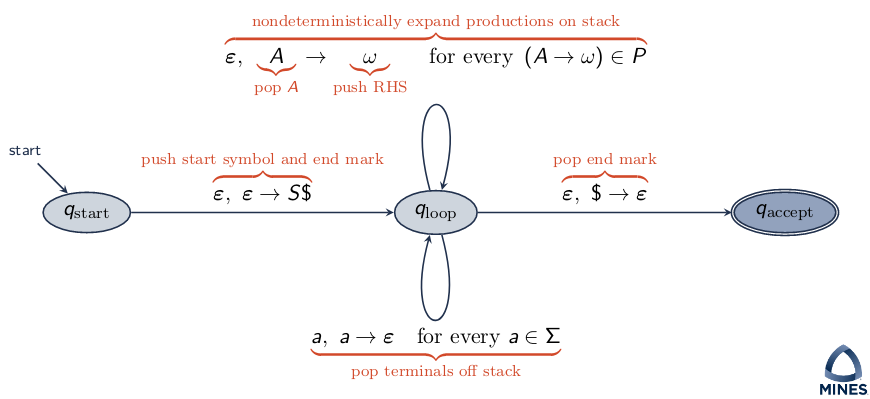
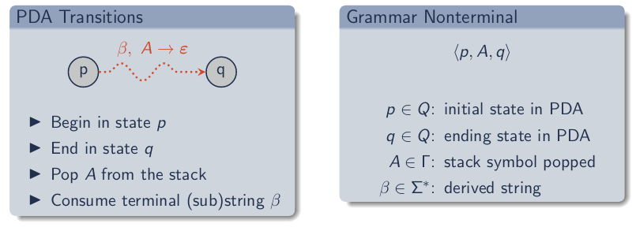
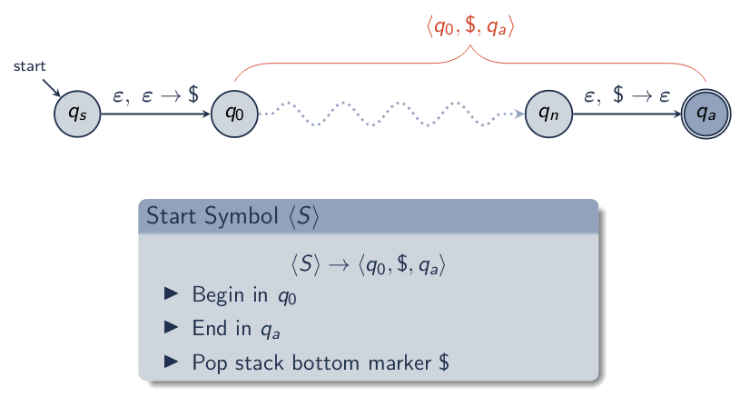
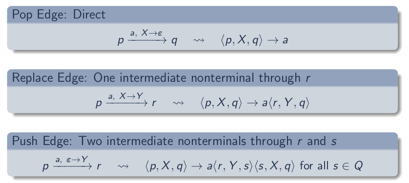
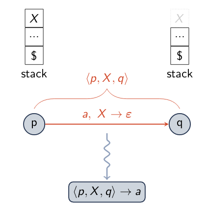
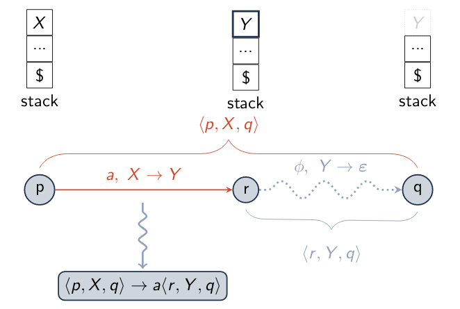
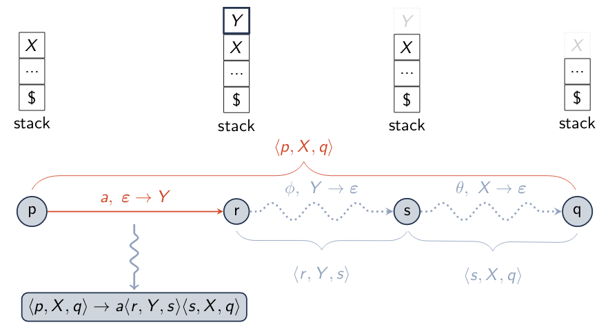

\title{Pushdown Automata}
\maketitle

# Introduction

Automata with finite control state + pushdown stack

- Control state: handles viewing current state in FA, are there transitions going out that matches current symbol in string, does it end with an accept. 
- Pushdown stack: idk, probably will know about it after this though

Pushdown automata equivalent to context-free grammar

# Outline

- Pushdown Automata
- Context-Free Grammar to PDA
- PDA to Context-Free Grammar

# Pushdown Automata (PDA)

A **pushdown automaton** is a 6-tuple M = (Q, $\Sigma$, $\Gamma$, $\delta$, q~0~, F) where: 

- Q is the finite set of states
- $\Sigma$ is the input alphabet
- $\Gamma$ is the stack alphabet
- $\delta$ Q $\times$ $\Sigma$ $\times$ $\Gamma$ $\mapsto$ P(Q $\times$ $\Gamma$) is the nondeterministic transition function
- q~o~ is the start state
- F $\subseteq$ Q is the set of accept states

## PDA State

PDA Transition

- Read next input symbol $\sigma$
- Pop top stack symbol $\gamma$~k~
- Push new stack symbol $\gamma$~l~
- Move from predecessor q~i~ to successor state q~j~

Stack Symbols:

- $\epsilon$ push/pop nothing
- \$: marks bottom of stack
- $\gamma$ $\in$ $\Gamma$: any other symbol

\newpage

{width=40%}

### Example PDA for 0^n^1^n^

\

Explanation: 

> For each transition on q~1~ (adding 0's) we push **m** to the stack.

> For each transition on q~2~ (adding 1's) we pop **m** from the stack. 

> When the stack is empty again we will go to q~3~ and end. This gives us an even number of 0's 1's because the amount of **m**'s pushed must be identical to **m**'s popped. 

Example, matching 0011 on above PDA

> Start with pushing two m's on the stack

> Pop two m's from the stack

> End on q~3~

# Context-Free Grammar to PDA

Given: A CFG

Find: An equivalent PDA

Approach: Construct a PDA corresponding to a left-to-right scan, left-most derivation: 

- Store the current RHS of productions on the stack 
- Pop terminals on top of the stack, reading from the input string
- Nondeterministically expand nonterminals on top of the stack by popping the nonterminal pushing its RHS

\newpage

## Extended PDA Diagrams

We can rewrite PDA diagrams with multiple transitions. Easier to represent when doing CFG representations.

{width=70%}

## CFGs to PDAs

\

Explanation: 

> - For the transition (from start) and (to accept). They use a dollar sign to determine when to stop for the CFG. 

> - One of the self transitions for q~loop~ is for all the possible terminal transitions. 

>> - For example a,a &rarr; $\epsilon$ is used to pop the terminal a off the stack 

> - The other self transitions is for the expansion of nonterminals.  

\newpage

# PDA to Context-Free Grammar

Idea: CFG derivations simulate PDA transitions

Given: PDA M = (Q, $\Sigma$, $\Gamma$, $\delta$, q~0~, F)

Find: Equivalent CFG G = (V, T, P, S)

Assume: M has a single start state pushes that pushes $ and a single accept state with empty stack. We can always convert M to this form with symbols/state push/empty the stack

Approach: Construct nonterminals (p, A, q) indicating PDA traces that:

- Begin in state p 
- End in state q
- Erase A from the stack

## PDA to CFG Nonterminals

\
{width=90%}

## Start Symbol Production

\
{width=90%}

## Productions for \<p,X,q\>

\
{width=80%}

### Pop Case

\
{width=80%}

### Replace Case

\
{width=80%}

### Push Case

\
{width=80%}

