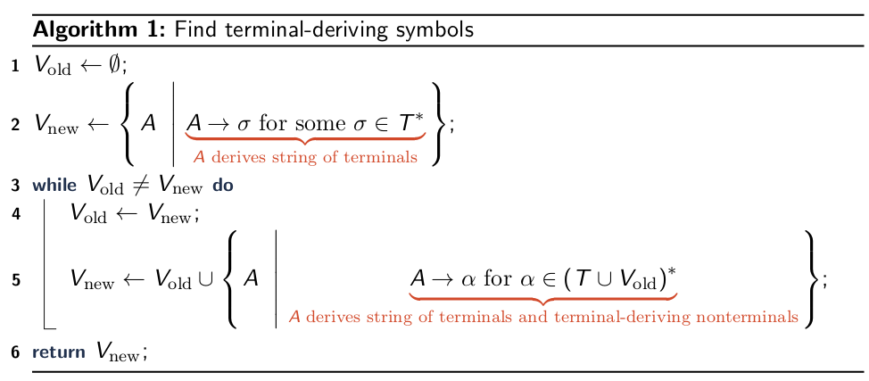
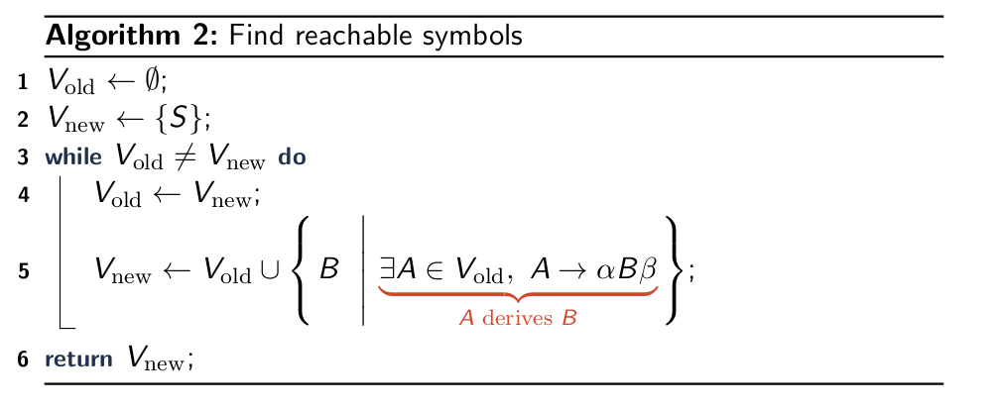
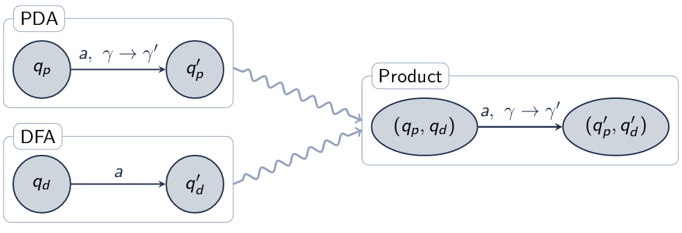

\title{Context-Free Languages} 
\maketitle

# Outline

- Decision Properties of CFLs
- Closure Properties of CFLs 

# Decision Properties of CFLs 

Summary of CFL Decision Properties

- Can answer: 
    - Membership: $\omega$ $\in$ C 
    - Emptiness: C = $\emptyset$ 
    - Regular Subset: C $\subseteq$ R
- Cannot Answer
    - Equivalence: C~1~ = C~2~
    - Disjoint: C~1~ $\cap$ C~2~ = $\emptyset$
    - Subset: C~1~ $\subseteq$ C~2~

## Membership 

Given: CFL L, string w

Find: Is $\omega$ in L?

Solution (simple): Simulate PDA for L on $\omega$

Solution (fast): Many specialized parsing algorithms. For string of length n: 

- Earley: Any CFL, O(n^3^) 
- CYK: Any CFL, O(n^3^) 
- LALR: Some CFL, O(n)
- LL(1): Some CFL, O(n)
- LL(\*): Some CFLs and some non-CFLs, O(n^2^)

## Emptiness

Given: CFL L 

Find: Is L empty

Idea: In a CFG for L, can the start symbol derive a string of terminals

### Useful Symbols 

Useful: Nonterminal \<X> is useful if: 

>  There exists a derivation \<S> $\rightsquigarrow$ $\alpha$\<X\>$\beta$ $\rightsquigarrow$ $\omega$, where \<S> is the start symbol and $\omega$ $\in$ T\*

Requirements: Two requirements for usefulness: 

1. A terminal string is derivable from \<X> 
2. \<X> is in string derivable from \<S> 

Useless: no such derivation using \<X>

\
{width=85%}

\
{width=85%}

### Useless Symbols

V~useful~ = V~terminal-deriving~ $\cap$ V~reachable~

P~useful~ = are productions containing only V~useful~

### Emptiness (Redefined) 

Given: Context-Free Grammar G

Find: Is the language of G empty?

Solution: Is start symbol S a useless symbol

# Closure Properties of CFLs

## CFL Closure under Concatenation

Given: CFGs

> A = (V~a~, T~a~, P~a~, S~a~)

> B = (V~b~, T~b~, P~b~, S~b~)

Find: C = (V~c~, T~c~, P~c~, S~c~) where

> *L*(C) = *L*(A)*L*(B)

Solution: Concatenation of start symbols: 

> V~C~ = V~A~ $\cup$ V~B~ $\cup$ {S'}
 
> T~C~ = T~A~ $\cup$ T~B~ 

> S~C~ = S' 

> P~C~ = P~A~ $\cup$ P~B~ $\cup$ {S' &rarr; S~A~S~B~}

## CFL Closure under Union

Given: CFGs

> A = (V~a~, T~a~, P~a~, S~a~)

> B = (V~b~, T~b~, P~b~, S~b~)

Find: C = (V~c~, T~c~, P~c~, S~c~) where

> *L*(C) = *L*(A) $\cup$ *L*(B)
 
Solution: Union on start symbols: 

> V~C~ = V~A~ $\cup$ V~B~ $\cup$ {S'}
 
> T~C~ = T~A~ $\cup$ T~B~ 

> S~C~ = S' 

> P~C~ = P~A~ $\cup$ P~B~ $\cup$ {S' &rarr; S~A~, S' &rarr; S~B~}

## CFL Closure under Repetition

Given: CFGs

> A = (V~a~, T~a~, P~a~, S~a~)

Find: C = (V~c~, T~c~, P~c~, S~c~) where

> *L*(C) = *L*(A)\*
 
Solution: Epsilon transition back to start symbols: 

> V~C~ = V~A~ $\cup$ {S'}
 
> T~C~ = T~A~ 

> S~C~ = S' 

> P~C~ = P~A~ $\cup$ {S' &rarr; S~A~S', S' &rarr; $\epsilon$}

## Intersection and Difference

Regular languages are closed under intersection and difference

Context-free languages are **NOT** closed under intersection and difference

### CFL Non-closure under Intersection

Theorem: The context-free languages are not closed under intersection[

Proof by counterexample: 

1. C~1~ = {a^n^b^n^c^i^ | n $\ge$ 1, i $\ge$ 1} is context-free: 

> \<S> &rarr; \<A>\<B> &nbsp; &nbsp; &nbsp; \<A> &rarr; a\<A\>b|ab &nbsp; &nbsp; &nbsp; \<B> &rarr; c\<B\>|c 
 
2. C~1~ = {a^i^b^n^c^n^ | n $\ge$ 1, i $\ge$ 1} is context-free: 

> \<S> &rarr; \<A>\<B> &nbsp; &nbsp; &nbsp; \<A> &rarr; a\<A\>|a &nbsp; &nbsp; &nbsp; \<B> &rarr; b\<B\>c|bc 

3. N = C~1~ $\cap$ C~2~

4. N = {a^n^b^n^c^n^ | n $\ge$ 1} is not context free (can prove with pumping lemma)
 
### CFL Non-closure under Difference

Corollary: The context-free languages are not closed under difference 

Proof by contradiction:

1. Assume the CFLs were closed under difference

2. Generally: L $\cap$ M = L \ (L \ M)

3. If CFLs were closed under difference, they would also be closed under intersection 

4. But CFLs are not closed under intersection, contradiction

\newpage

## CFL-Regular Intersection
  
Given: A context-free language and regular language as: 

> PDA P = (Q~P~, $\Sigma$, $\Gamma$~P~, $\delta$~P~, q~0,P~, F~P~)

> DFA D = (Q~D~, $\Sigma$, $\delta$~D~, q~0,D~, F~D~)

Find: PDA C such that *L*(C) = *L*(P) $\cap$ *L*(D)

Solution: Simulate P and D in parallel. Result is a PDA

> Q~C~ = Q~P~ $\times$ ~D~ and q~0,C~ = (q~0,P~, q~0,D~) and F~C~ = F~P~ $\times$ F~D~

> $\Gamma$~C~ = $\Gamma$~P~

> \

 
