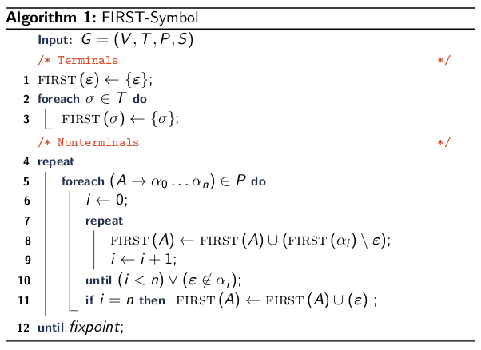

\title{Context-Free Parsing}
\maketitle

# Outline

- Parsing Overview
- Recursive Descent
- LL(1) Parsing
    - LL(1) Overview
    - First and Follow Sets
    - LL(1) Parsers

# Parsing Overview

Parsing Problem

- Given: Context-free grammar G
- Find: A program to recognize *L*(G)
- Approach: Construct a derivation from the start symbol to the input string. Many variations, and corresponding trade-offs, on how to do this!

## Leftmost and Rightmost Derivations

Leftmost Derivation: at each step in the derivation, apply a production for the **leftmost** nonterminal 

Rightmost Derivation: at each step in the derivation, apply a production for the **rightmost** nonterminal. 

&nbsp;

\
{width=80%}

## Common Parsing Algorithms

|          | Algorithm                 | Capability               | Runtime                    |
|:---------|:--------------------------|:-------------------------|----------------------------|
|Top-Down  |Recursive Descent          |Most Prog. Constructs     | varies                     |
|          |LL(1) (Lewis & Stearns '68)|Most Prog. Constructs     | O(n)                       |
|          |LL(\*) (Parr 2012)         |All LL(k), some non-CFLs  | O(n^2^) worst, often better|
|||||
|Bottom-Up |LR (Knuth '65)             |Deterministic CFL's (DCFL)| O(n)                       | 
|          |LALR (DeRemer '69)         |Most (useful) DCFLs       | O(n), less memory than LR  |
|          |GLR (Lang '74, Tomita '84) |All DCFL, some NCFL       | O(n^3^) worst, often better|
|||||
|Dyn. Prog.|CYK (Younger '67)          |Any CFL                   | O(n^3^)                    |
|          |Earley '70                 |Any CFL                   | O(n^3^)                    |

# Recursive Descent

Recursive Descent Parsing: 

- Set of mutually recursive procedures
- One procedure for each nonterminal 
- Each procedure: 
    - pick a production for the nonterminal 
    - recursively calls procedures for the RHS

\
{width=55%}

## Recursive Descent Summary

Pros: 

- Usually slightly faster than automatically generated parsers
- Can work-around non-context free language parts (eg. typedef'ed specifier vs identifier/variable name in C) 

Cons: 

- Must manually write parser based on grammar 

\newpage

# Factoring Grammars

Unfactored grammar: a nonterminal with multiple production rules that share the same start symbol. 

\
{width=70%}

# LL(1) Parsing

LL(1) Overview: 

- Algorithmically construct recursive descent-like parsers
- LL(1) Meaning
    - L = Left to right scan of string
    - L = Leftmost derivation
    - (1) = One terminal symbol of lookahead: pick the next derivation step (production) by looking at only one nonterminal
- Not all grammars are LL(1) 

## First Set

First Set: the first set FIRST($\alpha$) is the set of terminals that may begin derivations of $\alpha$ 

- Given: CFG G = (V, T, P , S) 
- Find: Function FIRST: (V $\cup$ T)\* $\mapsto$ *P*(T), where
    - FIRST($\alpha$) is the set of terminals that may begin derivation of $\alpha$
    - FIRST($\alpha$) = {c $\in$ T | a $\rightsquigarrow$ c$\gamma$}

{width=30%}

### First Set Algorithm

\
{width=80%}

## Follow Set

Follow Set: the follow set FOLLOW($\alpha$) is the set of terminals that come after (follow) $\alpha$ is some derivation.
      
- Given: CFG G = (V, T, P, S) 
- Find: Function FOLLOW: V $\mapsto$ *P*(T), where
    - FOLLOW(A) is the set of terminals that may appear to the right of (following) A during some derivation for G
    - FOLLOW(A) = {c $\in$ T | S $\rightsquigarrow$ $\alpha$Ac$\beta$$\gamma$ } 

{width=30%} 

\newpage

### Follow Set Algorithm

\
{width=80%}

## LL(1) Requirements

Whenever A &rarr; $\alpha$ | $\beta$: 

1. $\alpha$ and $\beta$ cannot derive strings starting with same terminal: 

>> FIRST($\alpha$) $\cap$ FIRST($\beta$) = $\emptyset$

2. At most one of $\alpha$ and $\beta$ derives $\epsilon$ 

>> $\neg$(($\alpha$ $\rightsquigarrow$ $\epsilon$) $\wedge$ ($\beta$ $\rightsquigarrow$ $\epsilon$))

3. WLOG, if $\beta$ $\rightsquigarrow$ $\epsilon$, then $\alpha$ does not derive any string beginning with FOLLOW(A): 

>> ($\beta$ $\rightsquigarrow$ $\epsilon$ $\implies$ (FIRST($\alpha$) $\cap$ FOLLOW(A) = $\emptyset$) 

## Trick Cases 

**FILL THIS SECTION WHEN YOU'RE REVIEWING FOR THE FINAL**

\newpage

##  Parsing Table
 
Given: CFG G = (V, T, P, S) 
   
- Current nonterminal A $\in$ V
- Next input symbol $\sigma$ $\in$ T 

Find: Which production p $\in$ P to use for A: 

- M: V $\times$ T $\mapsto$ {P $\cup$ {$\emptyset$}}

\

## Predictive Parsing Overview
 
Predictive Parsing

- Given: Grammar, Parsing Table, Input string
- Find: A parse of the input string
- Approach: Store partial derivations on a stack and expand based on the parsing table: 

>> 1. Push the start symbol
>> 2. While the stack is not empty:

>>> 2.1 Pop the top of the stack

>>> 2.2 If a terminal, match with the next input symbol and pop

>>> 2.3 If a nonterminal, select expansion from the parsing tale according to the next input symbol and push the RHS

>> 3. Accept if we are at the end of the input string. Otherwise, reject. 

\

# Summary & Considerations

Selecting a parsing algorithm/parser generator: 

- Language support
- Capabilities: what constructs are easily handled
- Performance of generated parser

Writing the grammar: 

- Parser capabilities: modify grammar to suit
- Efficiency: tailor grammar to parsing algorithm
- Ambiguity: eliminate in grammar (LL(1)) or specify precedence (LALR) 
- Cannot fully automate grammar construction
