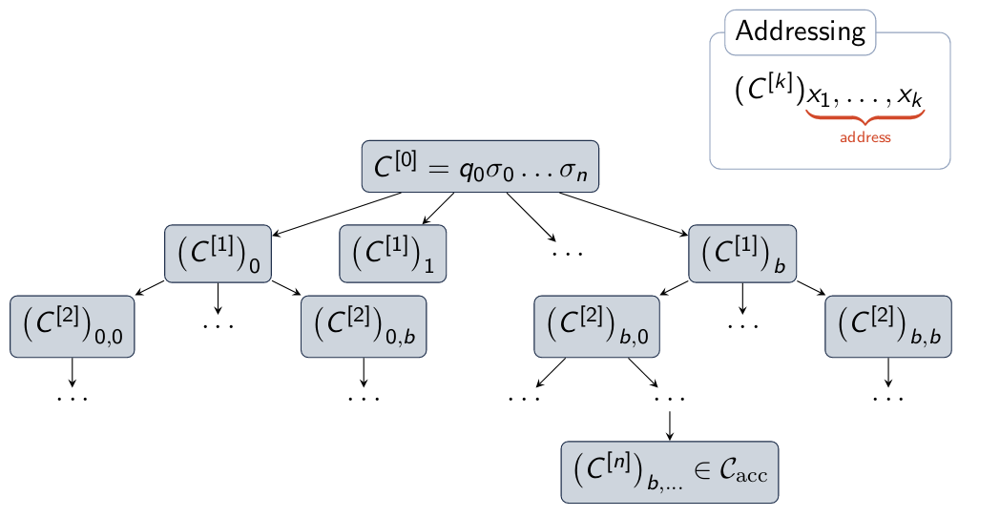

\title{Turing Machines} 
\maketitle

# Introduction

Turing machines: 

- The simplest model of general-purpose computation
- Mathematically define what we **can** compute, Prove we **cannot** compute

# Outline

- The Turing Machine
    - Operation
    - Examples
    - Languages
- Variants of Turing Machines
    - Multi-Tape Turing Machines
    - Nondeterministic Turing Machines
    - RAM Machine
    - Two-Stack Pushdown Automata
    - Chomsky Hierarchy 

# Turing Machine

| Finite automata | Turing machine| 
|:-----------------------|:--------------------------|
|Read-only input tape | Read-Write (memory) tape |   
|Left-to-right scan of input | Read head can move left and right | 
|Accept/Reject at end of string| Special states to immediately accept/reject | 

Turing Machine: A Turing machine is a 7-tuple T = (Q, $\Sigma$, $\Gamma$, $\delta$, q~0~, q~acc~, q~rej~), where

- Q is the finite set of states
- $\Sigma$ is the input alphabet not containing the **blank symbol** $\sqcup$ $\not\in \Sigma$
- $\Gamma$ is the tape alphabet, where $\sqcup$ $\in$ $\Gamma$ and $\Sigma$ $\subset$ $\Gamma$ 
- $\delta$: Q $\times$ $\Gamma$ $\mapsto$ Q $\times$ $\Gamma$ $\times$ {L,R} is the transition function 
- q~0~ $\in$ Q is the start state
- q~acc~ $\in$ Q is the accept state
- q~rej~ $\in$ Q is the reject state, where q~rej~ $\not$= q~acc~

\newpage

## Turing Machine Execution 

[**LINK^1^: EXAMPLE OF TURING MACHINE CONSTRUCTION**](https://www.youtube.com/watch?v=D9eF_B8URnw)

[**LINK^2^: EXAMPLE OF TURING MACHINE CONSTRUCTION**](https://www.youtube.com/watch?v=cR4Re0YfoOo)

Note: Deterministic means every state has an edge for every single symbol in $\Sigma$

### Turing Machine Configurations

The configuration of a Turing machine si given be $\alpha$q$\beta$, where 

- q $\in$ Q is the current control state
- $\alpha$ $\in$ $\Gamma$\* is the tape contents up to the location before current head position
- $\beta$ $\in$ $\Gamma$\* is the tape contents from the current head position to the last non-blank character (the head is on the first element of $\beta$) 

Under the assumption that Q and $\Gamma$ are disjoint: Q $\cap$ $\Gamma$ = $\emptyset$

### Special Configurations

Start Configuration 

> C^[0]^ = q~0~$\sigma$, 

> where q~0~ $\in$ Q is the start state and $\sigma$ $\in$ $\Sigma$\* is the input string

Accepting Configuration

> C~acc~ = {$\alpha$q~acc~$\beta$ | $\alpha$ $\in$ $\Gamma$\* $\wedge$ $\beta$ $\in$ $\Gamma$\*},

> where q~acc~ $\in$ Q is the accept state

Rejecting Configuration 

> C~rej~ = {$\alpha$q~rej~$\beta$ | $\alpha$ $\in$ $\Gamma$\* $\wedge$ $\beta$ $\in$ $\Gamma$\*},

> where q~rej~ $\in$ Q is the reject state

### Execution

TM Execution: given string $\omega$, TM T tracks configurations C~[0]~, C~[1]~,... , C~[n]~, where 

1. C^[0]^ is the start configuration
2. Each transition goes from C~[i]~ to C^[i+1]^
3. C^[n]^ $\in$ C~acc~ $\cup$ C~rej~) is an accepting or rejecting configuration

TM Behaviours: 

1. Enter accept state
2. Enter a reject state
3. Loop forever

## Turing Machine Languages

The language **recognized** by Turing machine T is the set of strings which T will enter an accepting configuration. 

The language **rejected** by Turing machine T is the set of strings on which T will enter a rejecting configuration. 

## Recognizer and Decider

Recognizer: Turing machine T is a recognizer for language L if it enters an accept state for every string in L and does not enter an accept state for every string not in L

> *L*~acc~(T) = L 

Decider: Turing machine T is a decider for language L if it always enter an accept or reject state, i.e., never loops forever. T decides its language. i

> T decides L if *L*~acc~(T) = L and *L*~rej~ = $\bar{\text{L}}$

&nbsp;

For each $\alpha \in$ L and $\beta$ $\not\in$ L:

| Recognizer for L | Decider for L    | 
|:----------------:|:----------------:|
| Accepts $\alpha$ | Accepts $\alpha$ |
| Does not accept $\beta$|Rejects $\beta$|
|Can loop forever | Always halts|

## Turing-Recognizable and Turing-Decidable Languages

Language L is **Turing-recognizable** if there exists some Turing machine T that recognizes L. 

> That is, $\exists$T, *L*~acc~(T) = L 

Language L is **Turing-recognizable** if there exists some Turing machine T that recognizes L. 

> That is, $\exists$T, ((*L*~acc~(T) = ) $\wedge$ (*L*~rej~(T) = $\bar{\text{L}}$))
 
\newpage

# Variants of Turing Machines

## Multi-Tape Turing Machines 

\

\

## Nondeterministic Turing Machines 

\
{width=70%}

\

## Deterministic Simulation: Iterative Deepening Search

\

Deterministic Simulation Steps: 

1. Initially, input tape contains input string $\sigma$ (Simulation and Address tapes are empty) 
2. Copy Input tape to Simulation tape
3. Use simulation tape to follow one branch of the nondeterminism

    3.1. Before each step, consult the address tape to determine which nondeterminism branch to follow

    3.2. If choice is invalid, no more address symbol remain (at current depth limit), or we reach a rejecting configuration, go to step 4

4. Increment the address (lexicographically next string). Go to step 2 to simulate the next branch or depth level. 

## RAM Machine

\

## Two-Stack Pushdown Automata

\

Theorem: Two stack pushdown automata are Turing complete
 
Proof outline: 

1. Can construct Turing machine to simulate any two-stack PDA
2. Can construct two-stack PDA to simulate any Turing machine

\newpage

## Chomsky Hierarchy

\

\newpage

# Links

1. https://www.youtube.com/watch?v=D9eF_B8URnw

2. https://www.youtube.com/watch?v=cR4Re0YfoOo 

