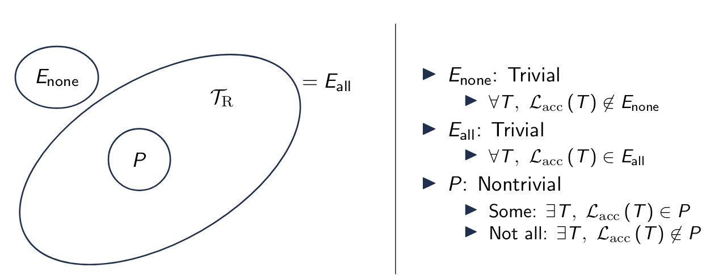

\title{Decidability}
\maketitle

# Outline

- Algorithms and Decidability
- Turing-Unrecognizable Languages
- Halting Problem
    - Definition
    - Proof
    - Implications

# Algorithm

Algorithm: a Turing machine that always accepts or rejects (a decider) 

> Output: the contents of the tape when the Turing machine halts

Algorithm Features: 

1. String-encoding of input (serialization)
2. Finite control (instructions) 
3. Infinite (arbitrary-length) storage

TM (Algorithm Features) Representation: 

1. String-encoding: input string
2. Finite control: control states
3. Storage: tape

# Decidability 

A problem (language) is **decidable** iff there exists a Turing machine that decides (always accepts or rejects) its language. Equivalently, a problem is decidable iff an algorithm exists for the problem. 

## Theorem: DFA Decidability (NFA and Regex too)

Theorem (DFA decidability): Let the acceptance problem for DFAs be

> A~DFA~ = {(B,$\omega$) | B is a DFA that accepts input string $\omega$}

> A~DFA~ is decidable 

Proof Idea: Construct Turing Machine M as follows: 

1. Simulate B on input $\omega$ 
2. If the simulations end in an accept state, M accepts. Otherwise, if the simulation ends in a non-accepting state, M rejects. 

This proof can be applied to both NFA and regex by converting them into DFAs. 

## Undecidability

A problem (language) is **undecidable** iff there DOES NOT exist a Turing machine that decides (always accept or reject) its language. Equivalently, a problem is undecidable iff no algorithm exists for the problem. 

# Turing-Unrecognizable Languages

## Turing Machine Descriptions

Descriptions of Turing machines are finite and serializable

A language may consist of descriptions of Turing machines

## Turing-Unrecognizable Languages

Theorem: Some languages are not recognizable by any Turing machine 

> That is, there exists some language L for which no Turing machine T exists such that T recognizes L: 

> $\exists$L, $\not\exists$T, *L*~acc~(T) = L 

There are unsolvable problems D:<

## Correspondences 

A function f: X $\mapsto$ Y is a **correspondence** (bijection) iff: 

1. One-to-one (injective): every element of X maps to a unique element of Y
2. onto (surjective): every element of Y is mapped from some element of X

## Countable sets

A set S is countable iff we can assign a unique natural number to every element of S. That is, either: 

1. S is finite (|S| < $\infty$)
2. S corresponds to the natural number $\mathbb{N}$ = {0,1,2,...}

Languages are countable (L is a set of finite-length strings) 

The set of real numbers $\mathbb{R}$ is uncountable

The set of infinite boolean sequences $\mathbb{B}$ is uncountable

The set of all languages is uncountable

## Turing-Unrecognizable Languages: Conclusion

There exists languages which cannot be recognized by any Turing machine. 

1. The set of Turing machines is countable

2. The set of all languages is uncountable

3. Thus there exists a language with no corresponding Turing machine

# Halting Problem

Halting Problem: Given Turing machine T and input $\omega$, does T halt on $\omega$?

> HALT~TM~ = {(T,$\omega$) | T is a TM and halts on input $\omega$}

Theorem: halting problem is undecidable

## Implications of Halting Problem 

Direct: cannot generally check whether a program has an infinite loop

Corollary: we cannot generally check whether a program has any nontrivial property

## Properties

Property: a set of languages

Property of TM: Turing machine T has property P iff: 

> *L*~acc~(T) $\in$ P 

Trivial properties: none or all of the Turing-recognizable languages: 

- None: E $\cap$ *T*~R~ = $\emptyset$
    - $\forall$T, *L*~acc~(T) $\not\in$ E

- or All: E $\cap$ *T*~R~ = *T*~R~
    - $\forall$T, *L*~acc~(T) $\in$ E

Non-trivial: Some, but not all, of the Turing-recognizable languages: 

- Some: P $\cap$ *T*~R~ $\not$= $\emptyset$
    - $\exists$T, *L*~acc~(T) $\in$ P
- and not All: P $\cap$ *T*~R~ $\not$= *T*~R~
    - $\exists$T, *L*~acc~(T) $\in$ P

## Trivial Properties are Decidable 

Theorem: Let E be a trivial property of a Turing machine. That is, E is a set of languages where either: 

1. For all Turing machines M L~acc~(M) $\in$ E
2. Or all Turing machines M, L~acc~(M) $\not\in$ E

Then, given Turing machine T, it is decidable to determine whether L~acc~(T) $\in$ E 

Proof (construction): Turing machine D, which takes Turing machine T, as input decides membership in E. That is, D decides whether L~acc~(T) $\in$ E. D operates based on the following two cases for E:

1. For all Turing machines M, L~acc~(M) $\in$ E: D always accept
2. Or for all Turing machines M, L~acc~(M) $\not\in$: D always reject

## Rice's Theorem

Theorem: Let P be a nontrivial property of a Turing machine. That is, P is a set of languages where

1. There exists a Turing machine M where L~acc~(M) $\in$ P
2. There exists a Turing machine M' where L~acc~(M') $\not\in$ P 

Then, given Turing machine T, it is undecidable to determine whether L~acc~(T) $\in$ P
