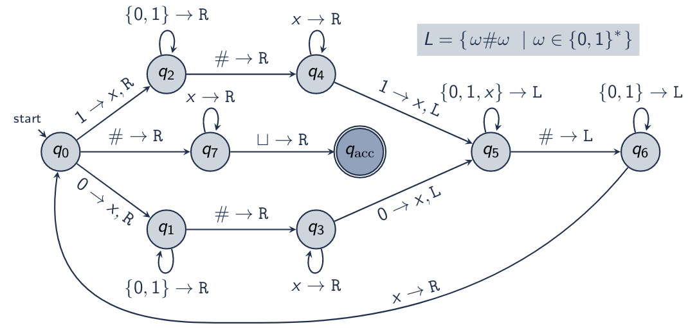

\title{Time Complexity} 
\maketitle

# Outline 

- Time Complexity 
- Complexity Relationships 
    - Multi-Tape Turing Machines
    - Nondeterministic Turing Machines
- P vs NP 
- NP-Completeness and the Cook-Levin Theorem 
- Other NP-Complete Problems

# Time Complexity 

Asymptotic (Upper Bound) Notation: f(n) = O(g(n)) represents the asymptotic upper bound of f(n) without regard for constant factors. Specifically: 

> Given functions f and g: 

>> f,g: $\mathbb{N}$ $\mapsto$ $\mathbb{R}$^+^

> If there exists natural numbers c and n~0~ where: 

>> $\forall$(n > n~0~), (f(n) $\le$ cg(n))

> We indicate the asymptotic upper bound of f(n) as O(g(n))

Asymptotic Time Complexity: The asymptotic time complexity of a Turing machine (algorithm) T that halts on all inputs is the asymptotic upper bound on the number of steps T takes for a given input size n. 

> That is, given input of size n, Turing machine T will take some f(n) steps to compute it results. The asymptotic time complexity of T is O(f(n))

## Time Complexity Terms

Constant: O(1)

Logarithmic: (ln n) 

Linear: O(n) 

Quadratic: O(n^2^)

Polynomial: O(n^k^) 

Exponential: O($2^{n^{a}}$), where a > 0

\newpage

## Example Turing Machine Complexity

\

High-level description of the Turing machine: 

1. For each string in the first half of the input, replace with x and sweep to the corresponding position in the second half. 
2. If the item in the second half does not match, reject
3. Otherwise, the item matches, replace with x and sweep back to the next element in the first half. 
4. When all items have been matched and replaced with x, accept. 

Complexity: 

- "For each item in the first half" translates to O(n/2)
- "Sweep Forward" translates to O(n/2)
- "Sweep Back" translates to O(n/2) 
- TOTAL COMPLEXITY: O(n/2 (n/2 + n/2)) = O(n^2^/2) = O(n^2^)

## Time Complexity Class

For function t: $\mathbb{N}$ $\mapsto$ $\mathbb{R}$^+^, the **time complexity class** TIME(t(n)) is the set of languages (problems) decidable by a Turing machine (algorithm) in time O(t(n)). 

Dumdum: a class to determine if a algorithm can be solved in a certain time complexity.

\newpage

# Complexity Relationships

## Multi-Tape Turing Machine Complexity

Let M be a multi-tape Turing machine with time complexity of O(f(n)). Then, we can simulate M with a single-tape Turing machine S with time complexity O(f^2^(n)). 

Review of Multi-Tape Simulation Step: 

- To simulate a multi-tape move of M: 
    1. Scan single-tape of S to determine symbols under each virtual head (finite combination) 
    2. Re-scan single tape to update symbols and virtual head positions. 
- If a virtual head moves onto tape separator (#) 
    1. Write a blank symbol ($\sqcup$) over the #
    2. Shift tape contents right by one space
    3. Resume simulation

Proving Complexity: 

- Writing initial tape configuration of S takes O(n) to copy the length n input
- For each step of M, S makes two passes over the active (written/non-blank) portion of its tape. 
    1. Read the contents of the tape under each virtual head
    2. Write the updated symbol under each virtual head
- The active portion of the tape has at most O(f(n)) entries, because we can write at most one new entry per step when moving right (left moves do not grow the active portion)
- Thus, each O(f(n)) Simulation steps takes O(f(n)) steps, resulting in O(f^2^(n)) steps
- Thus, S takes O(n) + O(f^2^(n)) steps

## Nondeterministic Simulation Complexity

Given nondeterministic TM N that always accepts or rejects and has time complexity f(n). There is an equivalent deterministic TM T with time complexity:

> 2^O(f(n))^

Detail: 

- Iterative deepening search: visit all nodes at depth d before visiting any nodes at d + 1
- Node count given b branches at each level: O(b^f(n)^) 
- Time to visit (deepen from the root) a node: O(f(n))
- Running time: O(f(n)b^f(n)^) = 2^O(f(n))^

# P vs NP

**P** is the class of languages decidable in polynomial time by deterministic, single-tape Turing machine: 

- Every regular language is in P
- Every context-free language is in P 

## Verifier

A verifier for language L is an algorithm V, where: 

> L = {$\omega$ | ($\omega$,m) $\in$ *L*(V) for some string m}

> that is: ($\exists$m, (($\omega$,m) $\in$ *L*(V))) $\leftrightarrow$ ($\omega$ $\in$ L)

Often faster to verify than to solve

### Verify to Solve (non-deterministically) 
  
Given: Deterministic verifier V for language L 

Find: Nondeterministic TM N where: *L*(N) = L 

Algorithm: N = 
    
1. Nondeterministically select (every) m
2. Simulate v on each M
3. If any simulation of V accepts, N accepts

Running time: If V is O(f(n)), then N is also O(f(n)) (but nondeterministic) 

## Nondeterministic Time Complexity Class

For function t: $\mathbb{N}$ $\mapsto$ $\mathbb{R}$^+^, the nondeterministic time complexity class NTIME(t(n)) is the set of languages (problems) decidable by a Nondeterministic Turing machine in O(t(n))

## NP 
 
**NP** is the class of languages with polynomial-time verifiers

Equivalently, NP is the class of languages decidable in polynomial time by a nondeterministic Turing machine. 

# NP-Completeness and the Cook-Levin Theorem 

## Cook-Levin Theorem

Cook-Levin Theorem: (SAT $\in$ P) $\leftrightarrow$ (P = NP)

## Reducing Nondeterministic TM to SAT

Nondeterministic Turing machine $\propto$ SAT

1. Unroll: represent one branch of NTM computation as a table 
2. Variables: boolean variables represent entries in each cell of the table
3. Formula: boolean formula encodes the start, accept, and moves of the NTM 

